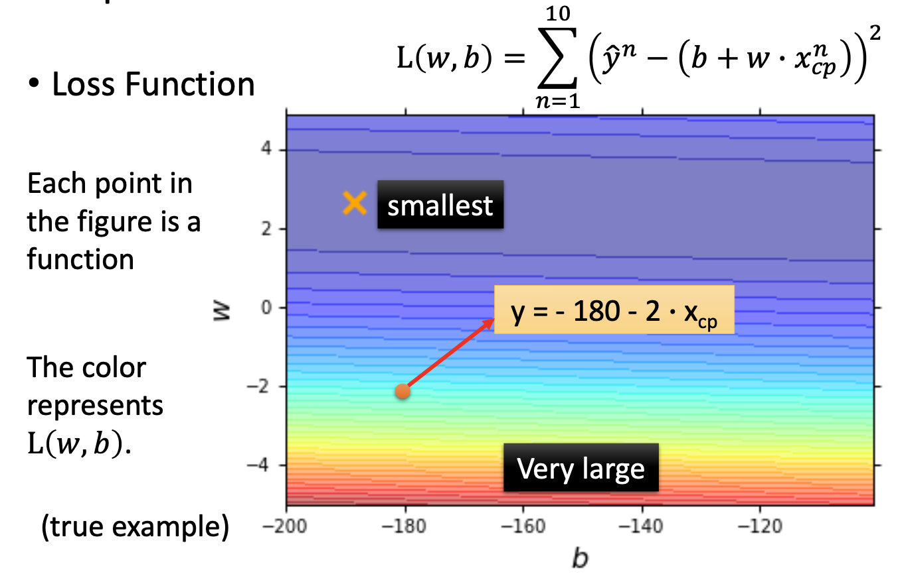
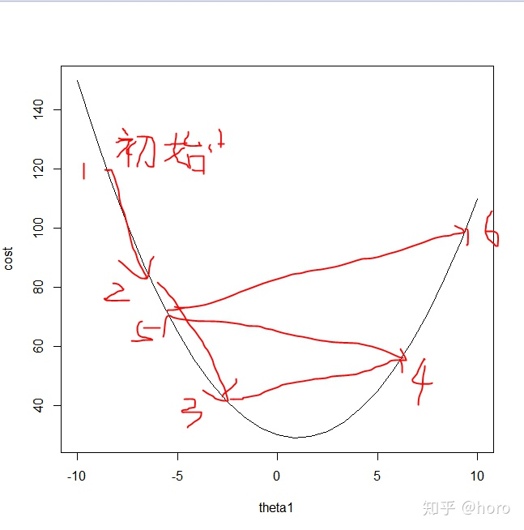
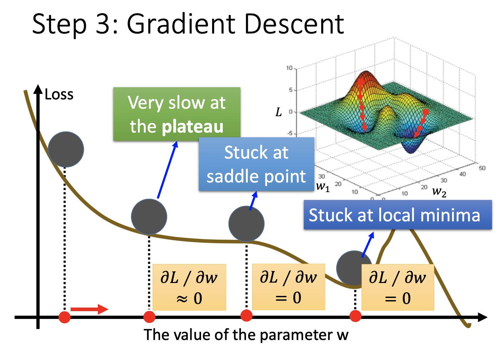
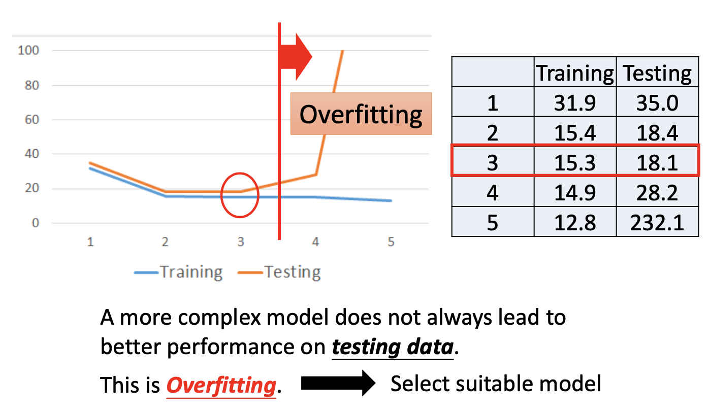
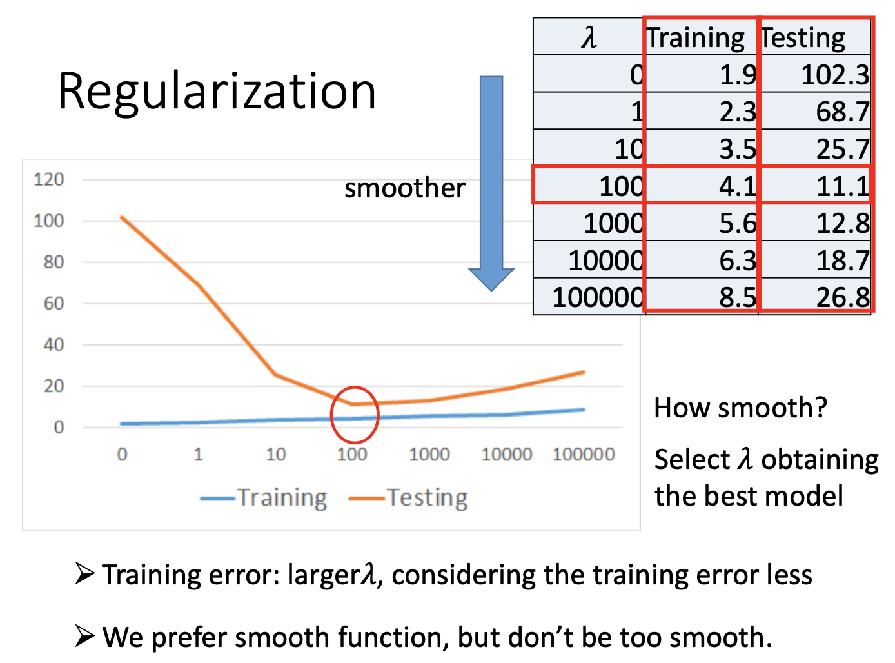

# 基本 (1)

## 主要内容

线性回归模型；梯度下降 (基本)；数据正则化

## 新名词

回归（Regression），损失函数（loss function），梯度下降（Gradient Descent），过度拟合（overfitting），正则化（regularization），scalar（纯量）

## 我的关注点

1. 线性模型：
   $$
   y = b + \sum_i {w_ix_i}
   $$
   其中每个 $$x_i$$ 被称为**特征**（feature），$$ w_i$$ 被称为**第 $$i$$ 个特征的权重**。

   回归（regression）的任务是找到一组比较好的参数 $$b, w_i$$ ，以让 $$y=f(x)$$ 构成一个最优质的函数。

2. **误差函数 (损失函数)**：用来评价一个函数 $$y=f(x)$$ **有多坏**。

   误差函数的输入是一个函数 $$f$$ ，输出是这个函数有多坏（值越高误差越大，函数就越坏）。

   例如，定义一个误差函数 $$\mathcal L(f)$$ 是「平方和误差」：
   $$
   \mathcal L(f) = \sum_{n=1}^{10} (\hat y^{(n)} - f(x^{(n)})) ^2
   $$
   注意上面其中， $$f(x^{(n)})$$ 就是根据第 $$n$$ 个输入（$$x^{(n)}$$）的值**预测出来**的第 $$n$$ 个输出值，而 $$(\hat y^{(n)} - f(x^{(n)})) ^2$$ 表示第 $$n$$ 个预测结论的**误差**。将 $$f$$ **值域**范围内的所有预测结论的误差加起来便是 $$f$$ 的误差函数值 $$\mathcal L(f)$$ 。

   实际上，因为 $$f$$ 的误差实际上是由 $$w$$ 及 $$b$$ 决定的，因此 $$\mathcal L(f)$$ 可以表征为 $$\mathcal L(w,b)$$ ，例如上面的 $$\mathcal L(f)$$ 式子可以表示为下式（如果只有一个输入特征 $$x$$ 的话）：
   $$
   \mathcal L(f)=\mathcal L(w,b)=\sum_{n=1}^{10} (\hat y^{(n)} - (b+wx^{(n)})) ^2
   $$
   如果有多个输入特征的话：
   $$
   \mathcal L(f)=\mathcal L(w,b)=
   \sum_{n=1}^{10} (\hat y^{(n)} - (b+ \sum _iw_ix_i^{(n)})) ^2
   $$

3. 下面讨论的都是只有 1 种特征的情况。

   为了达到回归的任务，需要找到一个最佳的 $$f$$ 函数 (即下边的 $$f^*$$ )，即等价于找到一组 $$w$$ 及 $$b$$ (即下边的 $$w^*, b^*$$ )，令其值与真正样本值的差异——即 $$\mathcal L(w,b)$$ 的值——最小。写成精准的数学算式如下：
   $$
   \begin{aligned}
   f^* &= arg\ {\rm min}_f \mathcal L(f) \\
   w^*, b^* &= arg\ {\rm min}_{w,b} \mathcal L(w, b)
   \end{aligned}
   $$
   方法：穷举法、梯度下降（Gradient Descent）法。

   穷举法：算出值域范围内的所有 $$\mathcal L(w,b)$$ 函数值，pick 值最小的点：

   

4. 梯度下降（Gradient Descent）法：利用损失函数 (多元) $$\mathcal L(w,b)$$ 的梯度：
   $$
   \nabla \mathcal L = 
   \left[ {
   \frac{\partial L}{\partial w},
   \frac{\partial L}{\partial b}
   } 
   \right] ^T
   $$
   
   - 当 $$\frac{\partial L}{\partial w}$$ 及 $$\frac{\partial L}{\partial b}$$ 最小的时候，认为 $$L(w,b)$$ 到达某个极小值点（local minimal），但不一定是最小值点（global minimal）；
   - 需要沿着 $$\frac{\partial L}{\partial w}$$ 及 $$\frac{\partial L}{\partial b}$$ 逐渐下降的方向（即所谓「梯度下降方向」）一步步调节参数 $$w$$ 及 $$b$$ ，直到 $$\frac{\partial L}{\partial w}$$ 及 $$\frac{\partial L}{\partial b}$$ 均到达 0 为止，才认为达到极小值点（local minimal）；
- 「梯度下降」的过程，就是 $$\frac{\partial L}{\partial w}$$ 及 $$\frac{\partial L}{\partial b}$$ 减小至 0 的过程。
  

备注：多元函数 $$f(x_1, x_2, ..., x_n)$$ 的梯度是：
$$
   \nabla f(x_1, x_2, ..., x_n) =
   \left[ {
   \frac{\partial L}{\partial x_1},
   \frac{\partial L}{\partial x_2},...,
   \frac{\partial L}{\partial x_n}
   } 
   \right] ^T
$$
5. 对损失函数 $$\mathcal L(w,b)$$ 进行**梯度下降**，以求出局部最优 $$w$$ 及 $$b$$ 的基本过程：

   - **【初始化】** 先**随机或者人为地制定**一组 $$w$$ 及 $$b$$ 的**初始值**： $$w^{(0)}$$ 及 $$b^{(0)}$$ ；

   - **【算梯度】** 计算当前梯度（即分别计算 $$\left.\frac{\partial L}{\partial w}\right|_{w=w^{(0)}}$$ 和 $$\left.\frac{\partial L}{\partial b}\right|_{b=b^{(0)}}$$ ）；

     - 如果计算出 $$\frac{\partial L}{\partial w}$$ (或 $$\frac{\partial L}{\partial b}$$) 是负数，表示 $$w$$ (或 $$b$$ ) 目前的值让 $$L(w,b)$$ 正在下降，可让 $$w$$ (或 $$b$$ ) 再增加少少**【负数 -> 增加值】**；反之

     - 如果计算出 $$\frac{\partial L}{\partial w}$$ (或 $$\frac{\partial L}{\partial b}$$) 是正数，表示 $$w$$ (或 $$b$$ ) 目前的值让 $$L(w,b)$$ 正在上升，则让 $$w$$ (或 $$b$$ ) 减少一些以便让它的值不要再增大**【正数 -> 减小值】**。

   - **【调参数】** 根据上一步计算结果，分别**调整参数**：
$$
     \begin{aligned}
     w^{(1)} &= w^{(0)} - \eta\left.\frac{\partial L}{\partial w}\right|_{w=w^{(0)}} \\
     b^{(1)} &= b^{(0)} - \eta\left.\frac{\partial L}{\partial b}\right|_{b=b^{(0)}}
     \end{aligned}
$$
- 后一项的符号是 $$-$$ 的原因是 (以 $$w$$ 为例)：若 $$\left.\frac{\partial L}{\partial w}\right|_{w=w^{(0)}}$$ 为负数，就要增加 $$w$$ 的值，因此整个项的值应该是 $$+$$ 的；又由于 $$\left.\frac{\partial L}{\partial w}\right|_{w=w^{(0)}}$$ 已经是负数，因此需要 $$-$$ 号使该项为正，才能让 $$w$$ 得以增加。
  
     - $$\eta$$ 称为「学习率 (learning rate)」。学习率过大可能导致无法收敛，比如：
     
       

   - 重复前面两个步骤，直到某时刻 $$\nabla \mathcal L(w,b) \rarr 0$$ (即 $$w^{(i)} \rarr 0$$ 以及 $$b^{(i)} \rarr 0$$) 为止。

6. 关于梯度下降的 local minimal

   

   - 根据选的初始点（$$w^{(0)}$$ 或 $$b^{(0)}$$）不同，走过的梯度下降路线不同，可能到达不同的 local minimal 点，有可能最终来到 global minimal，有可能也到不了（上图的 stuck at local minimal）；
   - 有可能遇到驻点，梯度下降就提前停止了（上图的 stuck at saddle point）；
   - 有可能发生导函数趋于 0，即某个地方坡度非常非常缓，导致梯度下降提前停止（上图的 very slow at pleatau）

7. 更复杂的模型可能对于训练样本拥有较低的误差，但是可能在**测试集**上产生更高误差，称之为「过度拟合」：

   

   应该选用更适合数据的模型，然后再进行拟合

8. 多元函数的梯度下降调参方法一般表达：

   设 $$\theta_1, \theta_2, ..., \theta_n$$ 是损失函数 $$L(\cdot)$$ 的所有参数，并设 $$\theta = [\theta_1, \theta_2, ..., \theta_n]^T$$
   
   设 $$\theta$$ 在第 $$n\gt 0$$ 次梯度下降后更新的值是 $$\theta^{(n)}$$，初始值是 $$\theta^{(0)}$$，则
$$
   \theta^{(n+1)} = \theta^{(n)} - \eta\nabla L(\theta^{(n)})
$$
9. 数据的正则化（regularization）：在损失函数值达到尽可能小的同时，又令**相关参数的值尽可能小一些**，使整个模型的函数更为 smooth。

   - 方法：在原来损失函数的基础上，加上一个与各特征的权重 $$w_i$$ 都相关的**附加项**「$$\lambda\sum_iw_i^2$$」：
$$
L(w,b) = \sum_{n} (\hat y^{(n)} - (b+ \sum_{i} w_ix_i^{(n)})) ^2 \lambda\sum_iw_i^2
$$
   本人把「$$\lambda$$」称为「平缓因子」。

   - 经过这样处理，附加项「$$\lambda\sum_iw_i^2$$」将能在使 $$L$$ 的值达到极值的同时，又使 $$w_i$$ 尽可能小一些，这样就能让对应的模型 $$f(x)=b + \sum_i {w_ix_i}$$ 更加**平缓**。

   - 事实表明：越平缓 (平缓因子 $$\lambda$$ 越大就会导致 $$w_i$$ 越小) 的函数，其**正确率**可能越高。因为这样，比较小的**扰动 (杂讯)** 不至于让 $$f(\cdot)$$ 的函数值变化较大，因而可能对一些**未能注意到的潜在因素**没那么敏感。

   - 但是也不能太平缓。**太平缓**的函数 (平缓因子 $$\lambda$$ 比较大而导致 $$w_i$$ 太小)，函数的在训练集和测试集上的错误率都可能增加：

     

## 派生问题

1. 对于线性函数，利用梯度下降和最小二乘法的优劣比较？

2. 如何解决驻点、局部最优问题？

   可以设置更小的学习率 $$\eta$$ ，多次迭代；

   可以进行**批量梯度下降**，同时寻找 $$n$$ 个局部最优值，再进行比较，如此即可；但是批量梯度下降有时如果非常不幸的话，也没法找到全局最优解。

