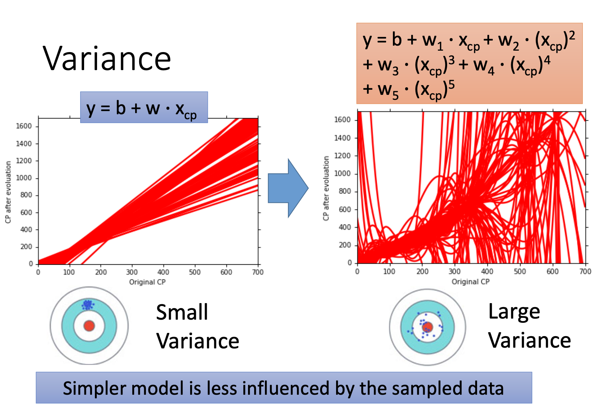
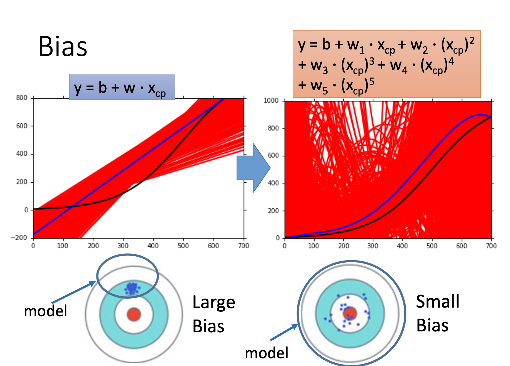
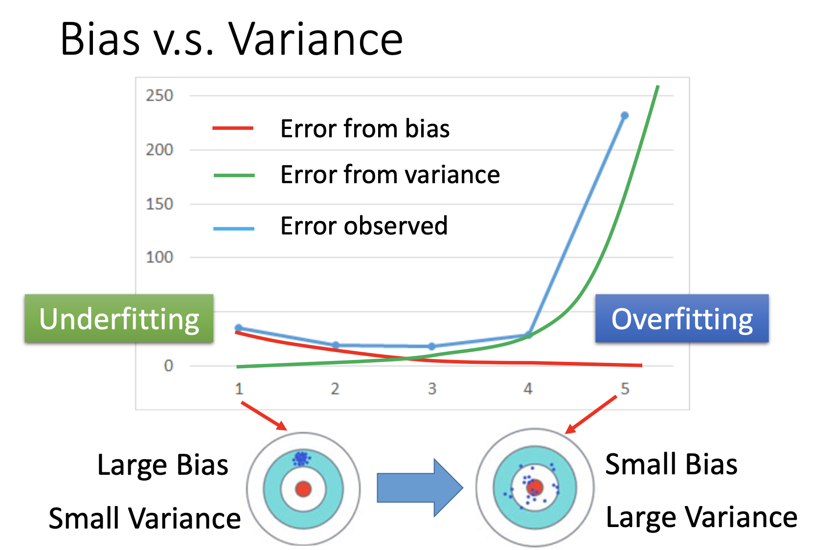
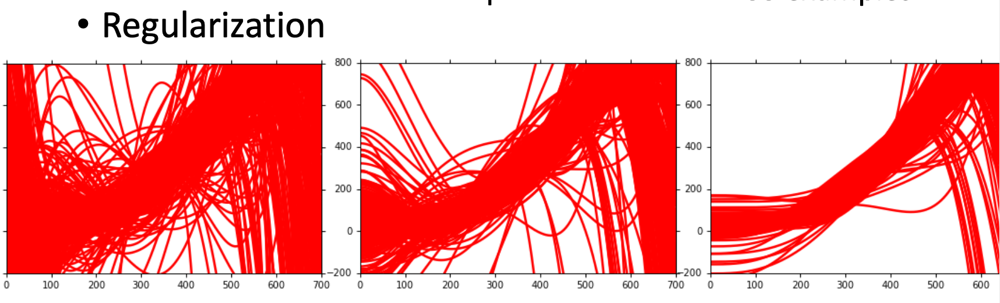
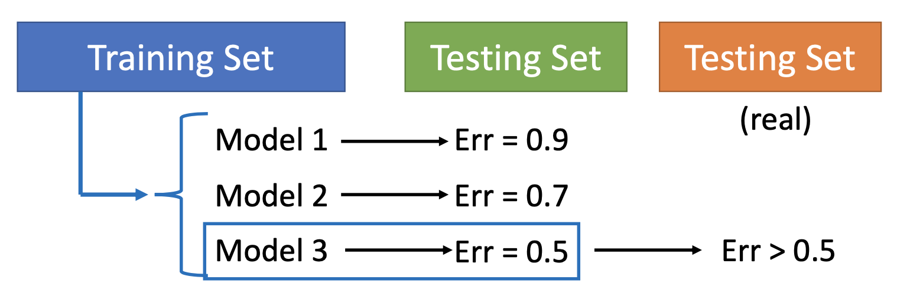
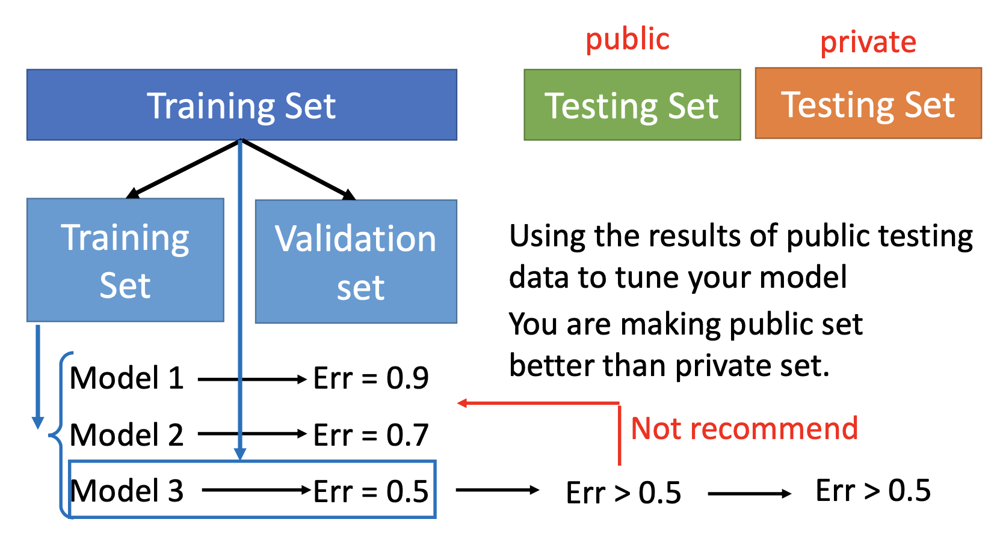
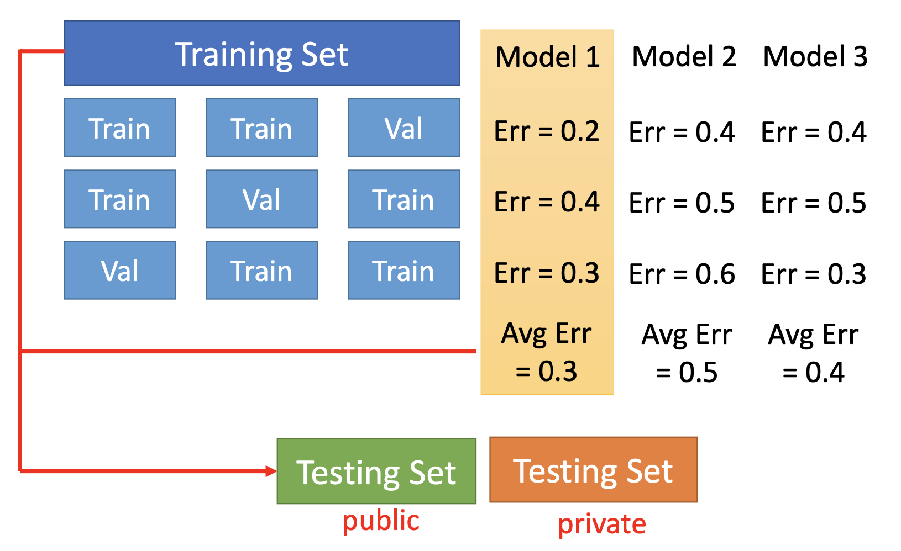

# 基本 (2)

## 主要内容

模型的错误；模型的选择

## 新名词

variance（方差）

## 我的关注点

1. 错误来源包括：bias，variance（方差）。若正确函数写作 $$\hat f$$ ，透过训练数据可以找到 $$f^*$$ ，则 $$f^*$$ 就是 $$\hat f$$的**估计量**。

2. 不同批次的训练数据，找到的 $$f^*$$ 会不同。

   - 【方差】 对于简单模型，找到的 $$f^*$$ 之间的方差会比较小，因为**简单模型刻画样本的能力弱，因此比较不容易受样本的变化所影响**；对于复杂模型，找到的 $$f^*$$ 之间的方差会比较大，因为**复杂模型能够较大程度地刻画样本数据，容易受样本的变化所影响**：

   

   - 【偏置】 对于简单模型，找到的 $$f^*$$ 之间方差较小，但偏置会比复杂模型找到的 $$f^*$$ 之间的**偏置大**（原因需要数学解释，大概的原因是复杂的模型比较能够真实地反映训练数据的分布）

     

   - 所有找到的 $$f^*$$ 综合起来可以得出一个「平均模型」，其位置与「真实模型」之间的差距称为 bias。

     而 bias 是真正衡量一个模型是否有用的标准。bias 偏移量越大，模型越垃圾。

     高阶 model 往往会造成其 bias 较小，从而导致高阶 model（或者说是复杂 model）的模型更贴合于数据的真实分布。

     但是当我们用**新的测试集**在高阶 model 上进行预测时，由于高阶 model 的形态**过分贴合训练集数据**且高阶 model 群较为繁杂，其在新的测试集数据上的**拟合优度一定不会很好**。

3. 欠拟合与过拟合：

   - 当错误大多来自「bias」的时候，称为「**欠拟合**」
   - 当错误大多来自「variance」而较少来自「bias」的时候，称为「**过拟合**」

   
   
   - 诊断方法：
   
     - 当模型根本就无法 fit 到**训练数据**时，表示「bias」已经很大了，发生了「**欠拟合**」
     - 当模型可以 fit 到训练数据，但是，在测试数据中表现出来比较大的错误，则「variance」可能比较大，可能发生了「**过拟合**」
   
   - 治疗措施：
   
     - 对于「欠拟合」问题，本质上是 bias 太大，可以 
   
       (1)    增加多个输入特征（即，输入多个 $$x_i$$ ）；或
   
       (2)    改成更为复杂的模型，比如采用更高次数的模型来进行拟合，或采用神经网络
   
     - 对于「过拟合」问题，本质上是 variance 太大，可以
   
       (1)    增加训练数据（效率高，但是有时并不实际）；或
       
       (2)    进行正则化（regularization），让模型更为平缓：
       
       
   
4. 欠拟合与过拟合的取舍问题：

   bias 和 variance 通常是一个「权衡（tradeoff）」的问题 。通常，应该选那些 bias 比较小，但是 variance 又不至于太大的模型比较合适。

   当我们说一个模型发生了欠拟合，那意味着这个模型在**根本层面**上就**很难很好地反映出数据的特征**，有可能需要根本否定之。

   而当我们说一个模型发生了过拟合，那意味着这个模型在训练集上的**训练过程是能非常细微得贴合数据特征**的，同时多次训练的 model 集得出的「平均 mode」与「真实 model」的 bias 是非常小的。这说明这 model 是具备使用的可能的。但如果我们继续把这个 model 放在**测试集**上进行测试，由于其过分贴合**训练集**数据，对**测试集**的预测就表现未必会很好，从而形成偏差。

   总的来说，欠拟合一般不能忍，**过拟合还是可以忍的**。但最佳状态是找到一个平衡点。

5. 模型的挑选方法：

   通常，因为要找 **bias 和 variance 权衡得比较好的模型**，而且人无法一眼看出来哪个模型平衡得比较好，所以可能需要设计多种模型以供选择 —— 这就面临着几种**待选模型**之间的抉择问题。

   因为实际上，研究人员只拥有「训练集」和「测试集」各一笔，但是并不掌握最终发布模型的「**实际使用测试集**」。

   有可能在训练集、测试集上表现得比较好的模型，在「实际使用测试集」上的表现并不好。

   - 挑选模型时**不应该**这样做：

     

     用「训练集」训练几个「待选模型」，而用「测试集」去测试每个模型的错误率，从而选出在「测试集」中表现最好的那个模型，或是利用在「测试集」中的表现去微调各个模型以使它们达到更好的效果。

     这个方法不够好。因为我们并没有「实际使用测试集」，因此可能在测试集上 Model 3 表现得好，但实际上它在**实际使用时效果可能不好**（即，测试集上的测试效果，**有可能**不能反映实际效果）。

     比如在上图中，Model 3 在测试集中的结果是错误指数为 0.5，但是一般情况下，这样选出来的模型 Model 3 在实际使用中的错误指数都会 > 0.5 的。

   - 可以采用的方法：Cross Validation

     

     将拥有的训练集分为两个部分，一部分是真正的「训练集」，一部分是「评估集」。利用真正的「训练集」进行模型训练，而**用「评估集」进行模型选择和模型微调**。

     这样，在「Public 测试集」上得到的结果就和「实际使用测试集（Private 测试集）」上的结果在概率上具有相似性，这样「Public 测试集」测试出来的结果方才具有参考意义。

     但是不要利用「Public 测试集」进行模型微调。有的人看到在「Public 测试集」上测试的结论比较烂，就擅自回去微调模型，这实际上就跟上一幅图描述的错误操作一样。

     总之，**只有保证「Public 测试集」和「Private 测试集」的【地位】一样，才能保证在「Public 测试集」上的结论和「Private 测试集」的结论具有可比照性**

   - 可以采用的方法：$$n$$-Fold Cross Validation

     

     是优化的「Cross Validation」，是为了消除**模型划分的偶然性**而设计。

     将训练集平均分为 $$n$$ 份，然后从它们中选一份当作「评估集」，其他当作「训练集」。**尝试对这样划分出来的所有组合做模型训练和评估**，并最终选取平均错误程度最低的模型作为最终的选择，或根据相关效果进行模型微调。

     可能计算难度大一些。

## 派生问题

（此处暂无）

