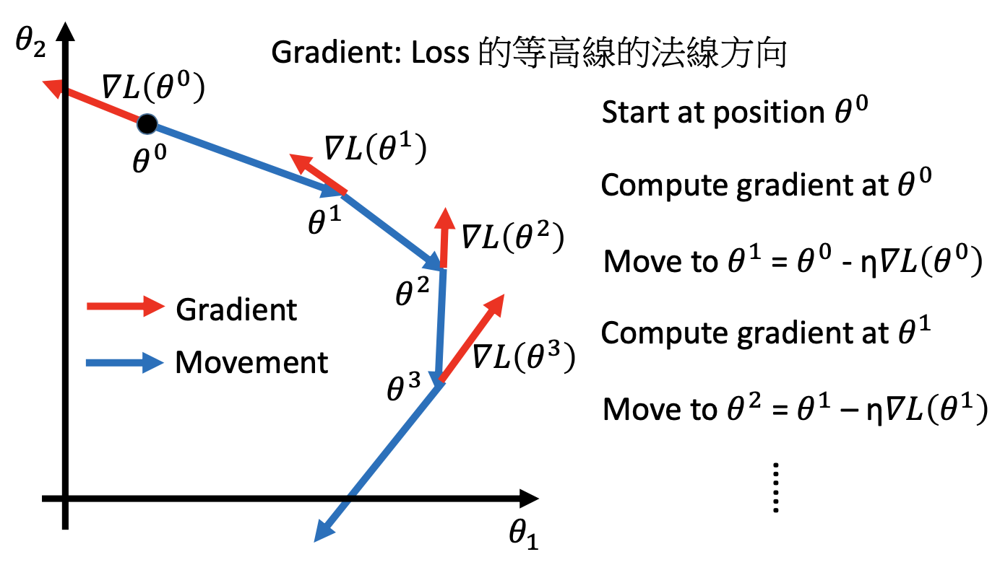
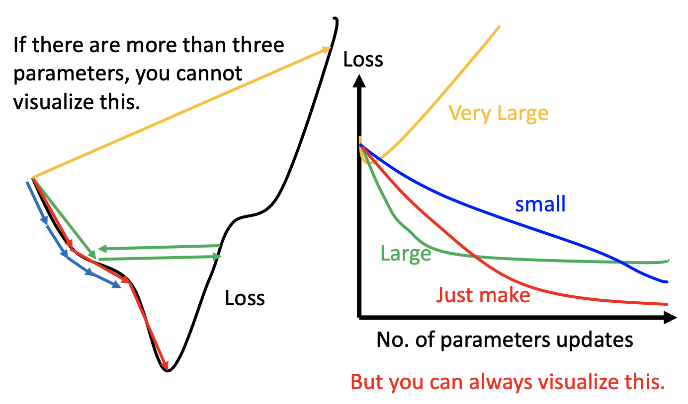
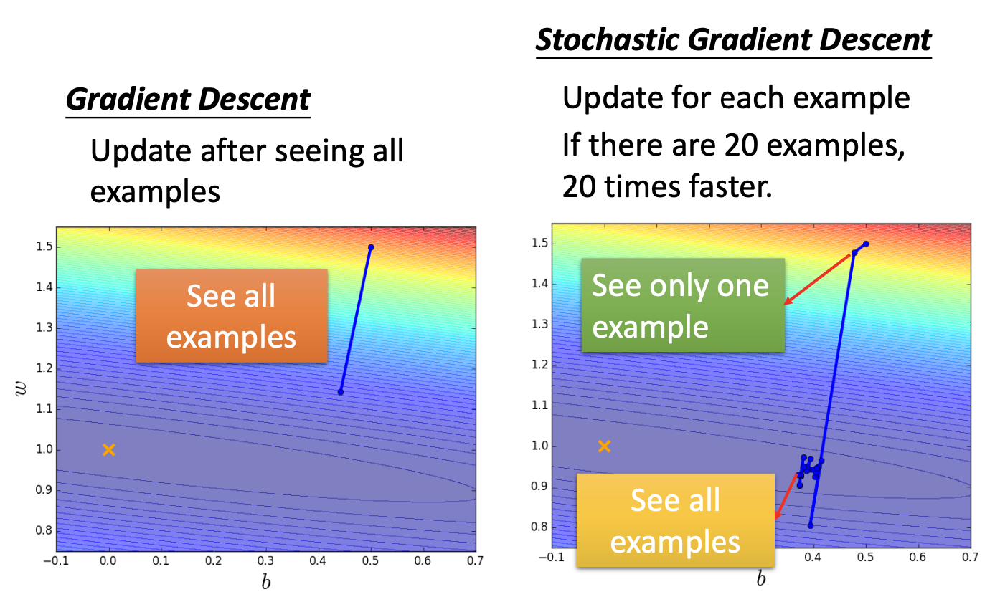
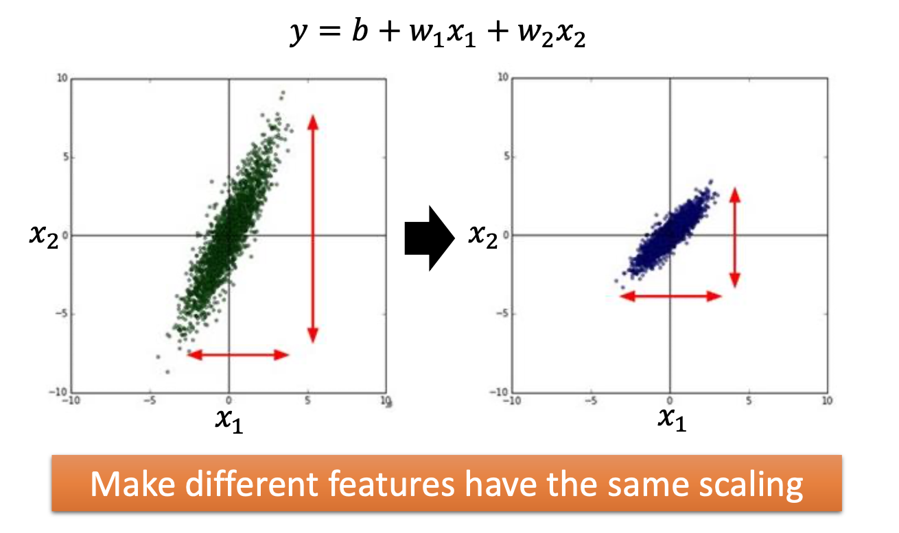
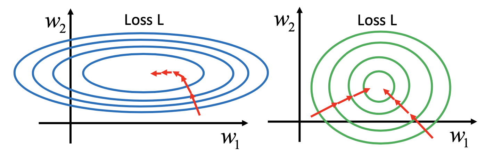
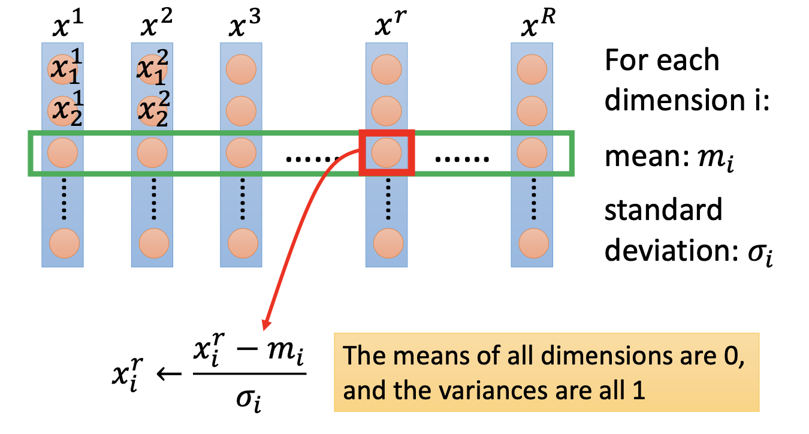

# 基本 (3)

## 主要内容

梯度下降 (进阶)，梯度下降的一些优化方法（Vanilla GD，Adagrad，Stochastic GD，Feature Scaling）

## 新名词

Feature Scaling；Stochastic GD（随机梯度下降，SGD）

## 我的关注点

1. **普通梯度下降**的方案：设 $$\theta_1, \theta_2, ..., \theta_n$$ 是损失函数 $$L(\cdot)$$ 的所有参数，并设 $$\theta = [\theta_1, \theta_2, ..., \theta_n]^T$$

   设 $$\theta$$ 在第 $$n\gt 0$$ 次梯度下降后更新的值是 $$\theta^{(n)}$$，初始值是 $$\theta^{(0)}$$，学习率是 $$\eta$$ ，则
   $$
   \theta^{(n+1)} = \theta^{(n)} - \eta\nabla L(\theta^{(n)})
   $$
   移动情形如下图中的蓝色连续箭头，而每次计算时的梯度方向如红色箭头所示

   

2. 为了使「梯度下降」的方案更加便于实际使用，应该实施这些操作：

   - 小心控制学习率「$$\eta$$」，或采用学习率自适应机制；
   - 采用一些方案加快收敛过程；
   - 做 Feature Scaling

3. 有关学习率：

   - 学习率应该小心设置。

     如果学习率设得过小，梯度下降的过程将会很慢（如下图中的「**蓝色**」箭头及图象）；

     如果学习率过大，可能「难以收敛」（如下图中的「**黄色**」箭头及图象，学习率过大导致每次调整的跨度都很大，最后飞出去），或者「发生自锁而不会收敛」（如下图中的「**绿色**」箭头及图象，学习率竟然大得恰到好处，让每次梯度下降都在**两个点之间晃来晃去**）：

     

   - 学习率自适应：随着梯度下降轮回过程，根据某些方案，**调小学习率**

     - 在刚开始时，因为离终点还有很远，因此用比较大的学习率；

     - 迭代几次后，离终点蛮近了，因此要调小学习率；

     - 例如：可以用「$$1/t\ {\rm Decay}$$」方案调整学习率：令 $$t$$ 为当前已经进行梯度下降的次数，而本次的学习率是：
       $$
       \eta^{(t)}= \frac{\eta^{(0)}}{\sqrt {t+1}}
       $$
       
     - 采用了「$$1/t\ {\rm Decay}$$」方案的梯度下降，称为「Vanilla Gradient Descent（普通梯度下降）」：
       $$
       w^{(t+1)} = w^{(t)} - \eta^{(t)}\frac{\partial L^{(t)}}{\partial w}
       $$

   - 学习率不应该「one-size-fits-all」。对于不同的参数，应该**维护不同的学习率**。

4. Adagrad 方法：在 Vanilla GD 的基础上，将每时刻的学习率再**除以**「该参数的之前所有学习率的**均方根** (**root mean square** of the derivatives of this parameter's previous learning rates)」：
   $$
   \begin{aligned}
   w^{(t+1)} 
   &= 
   w^{(t)} - 
   \frac{\eta^{(t)}}{\sigma^{(t)}_w}
   \frac{\partial L^{(t)}}{\partial w}\\
   &= 
   w^{(t)} - 
   \frac{\eta^{(t)}}{\sigma^{(t)}_w}
   g^{(t)}_w
   \end{aligned}
   $$
   其中， $$g^{(t)}_w = \frac{\partial L^{(t)}}{\partial w}$$ ，  $$ \sigma^{(t)}_w$$ 是「**参数 $$w$$ 在 $$t$$ 时刻之前所有学习率的均方根**」，写作：
   $$
   \begin{aligned}
   \sigma^{(t)}_w
   &=
   \sqrt{\frac{1}{t+1}\sum_{i=0}^{t}\left(\frac{\partial L^{(i)}}{\partial w}\right)^2}\\
   &=
   \sqrt{\frac{1}{t+1}\sum_{i=0}^{t}\left(g^{(i)}_w\right)^2}
   \end{aligned}
   $$
   例如一个算例是：
   $$
   \begin{aligned}
   w^{(1)} 
   &=
   w^{(0)} - 
   \frac{\eta^{(0)}}{\sigma^{(0)}_w}
   g^{(0)}_w, 
   &&{\rm where\ }\sigma^{(0)}_w=\sqrt{\left({g^{(0)}_w}\right)^2} \\
   
   w^{(2)} 
   &=
   w^{(1)} - 
   \frac{\eta^{(1)}}{\sigma^{(1)}_w}
   g^{(1)}_w, 
   &&{\rm where\ }\sigma^{(1)}_w=\sqrt{\frac{1}{2}\left[\left({g^{(0)}_w}\right)^2 + \left({g^{(1)}_w}\right)^2\right]} \\
   
   w^{(3)} 
   &=
   w^{(2)} - 
   \frac{\eta^{(2)}}{\sigma^{(2)}_w}
   g^{(2)}_w, 
   &&{\rm where\ }\sigma^{(2)}_w=\sqrt{\frac{1}{3}
   \left[
   \left({g^{(0)}_w}\right)^2 + \left({g^{(1)}_w}\right)^2 + \left({g^{(2)}_w}\right)^2
   \right]} \\
   
   &...\\
   
   w^{(t+1)} 
   &=
   w^{(t)} - 
   \frac{\eta^{(t)}}{\sigma^{(t)}_w}
   g^{(t)}_w, 
   &&{\rm where\ }\sigma^{(t)}_w=\sqrt{\frac{1}{t+1}\sum_{i=0}^{t}\left(g^{(i)}_w\right)^2} \\
   
   \end{aligned}
   $$

5. Adagrad 其他方面：

   对于 $$g^{(t)}_w$$ 这一项的参数，可以有如下简化：
   $$
   \begin{aligned}
   \frac{\eta^{(t)}}{\sigma^{(t)}_w}
   &= 
   \frac
   {\frac{\eta^{(0)}}{\sqrt {t+1}}}
   {\frac{\sqrt {\sum_{i=0}^{t}\left(g^{(i)}_w\right)^2}}{\sqrt{t+1}}}
   =
   \frac
   {\eta^{(0)}}
   {\sqrt {\sum_{i=0}^{t}\left(g^{(i)}_w\right)^2}}\\
   \end{aligned}
   $$
   因此
   $$
   \begin{aligned}
   w^{(t+1)} 
   &= 
   w^{(t)} - 
   \frac{\eta^{(t)}}{\sigma^{(t)}_w}
   g^{(t)}_w
   
   \\
   w^{(t+1)} 
   &=
   w^{(t)} - 
   \frac
   {\eta^{(0)}}
   {\sqrt {\sum_{i=0}^{t}\left(g^{(i)}_w\right)^2}}
   g^{(t)}_w
   
   \end{aligned}
   $$
   在数学上可以认为，Adagrad 优化后每一次梯度下降时行走的距离都是「**最佳距离**」

6. Stochastic Grandient Descent（随机梯度下降）：一种让梯度下降过程开销更小的方案

   - 提出背景：

     普通梯度下降所利用的「损失函数 $$L(\cdot)$$」，在最后一步把所有样本的损失加和后，才输出损失的值。对于**有很多训练样本**的模型，会导致项数过多，求导不方便，比较慢。

   - 随机梯度下降：将普通梯度下降的损失函数**按照每个样本进行拆分**的方案。每次只选用 1个样本进行梯度下降，令梯度下降的次数变多，但因为没有「加和」的过程，所以每次不用计算所有样本的梯度而**只需计算挑选出来的那 1 个样本的梯度**，因此计算开销比较小。

   - 随机梯度下降的细节：

     例如，普通梯度下降利用的「损失函数」可写作：
     $$
     L(w,b)=
     \sum_n(\hat y^{(n)}-(b+\sum_iw_ix_i^{(n)}))^2
     $$
     它每次梯度下降的参数更新方式可写作：
     $$
     \theta^{(i)}=\theta^{(i-1)}-\eta\nabla L(\theta^{(i-1)})
     $$
     其中，$$n$$ 是样本的编号，$$i$$ 是每一个样本的特征的编号

     对应地，随机梯度下降中，利用的「对应于**某个随机 pick 出来的样本 $$n$$** 的损失函数」可写作：
     $$
     L^{(n)}(w,b)=
     (\hat y^{(n)}-(b+\sum_iw_ix_i^{(n)}))^2
     $$
     可以发现没有了「$$\sum_n$$」号，即，这个式子是相对于「样本 $$n$$」而言的。在这样的随机梯度下降中，每次梯度下降的参数更新方式可写作：
     $$
     \theta^{(i)}=\theta^{(i-1)}-\eta\nabla L^{(n)}(\theta^{(i-1)})
     $$
     可以发现，$$L$$ 被换成了 $$L^{(n)}$$，表示，随机梯度下降中用来求梯度的损失函数被换成了「对应于**某个随机 pick 出来的样本 $$n$$** 的损失函数」。每次随机梯度下降都不必计算所有样本的梯度，只需考虑挑选出来的那个样本就可了。

   - 由于将梯度的计算开销从「$$O(n)$$」降低到了「$$O(1)$$」。

7. 随机梯度下降与普通梯度下降的比较图示：

   

   该图显示：随机梯度下降的速度计算复杂度减小了 20 倍。但是好像没有变快吧？？等待老师解答

8. Feature Scaling（特征缩放）：让**不同的特征**具有**相同的取值范围**

   

   - 特征缩放的必要性：让梯度下降的过程精准一些：

     

     如果不同特征的 scale 不一样（左图的例子是 $$w_1$$ 的取值范围比较大，而 $$w_2$$ 的取值范围比较小），可以看到「损失」的等高线会在**取值范围小的那个特征**的方向上偏密一些，另一个特征的方向上疏一些。

     左图这样的情况会导致经过多轮梯度下降后，梯度骤降（即，损失函数值下降得很缓慢），根据初始点的选择情况，可能导致**提前收敛**。

     右图，当把 scale 缩放了一下之后，$$w_1$$、$$w_2$$ 的取值范围趋于一致，等高线会趋于**同心圆**的形状。由于梯度下降都是沿着**等高线切线**进入的，因此不论从哪个点进入，几乎都是沿着圆心方向直到梯度为 0 处。这样不会有因为某个方向梯度变化得比较诡异而导致「**提前收敛**」的情况。

   - 特征缩放的操作过程：

     

     最终，会将所有样本的特征向量的每个维度（所有样本的每种特征）的平均都调至 0，而方差都调至 1。

9. 「梯度下降理论」是：
   $$
   w^{(t+1)} = w^{(t)} - \eta^{(t)}\frac{\partial L^{(t)}}{\partial w}
   $$
   这个理论的推导有应用「泰勒展开」，而且为了推导出理论，做的假设是「$$\eta$$」足够小，这样才能够保留相关「泰勒展开」算式的前两项，从而写成上面的形式。

   该理论成立的条件是「$$\eta$$」足够小。若「$$\eta$$」定得太大，上面算式就不成立了，梯度下降中「**调整参数**」的行为就不是最优的。

## 派生问题

1. 随机梯度下降为啥有效？它明明是随机 pick 一个样本阿？？

   本人思考：因为样本具有等效性，所以所有样本的损失其实可以反映到单个样本身上，因此随机梯度下降是有效的。

2. 分为多次计算梯度，和 1 次计算出所有梯度的效果既然一样，为啥要分开？？

   本人思考：虽然**速度可能不一定快**，但是计算的复杂度减小了 ($$O(n) \rarr O(1)$$)

3. SGD 还有甚么优化措施？

   其实，现在的算法中的SGD都是Mini-batch Gradient Descent（每次迭代不只 pick 1 个样本，而是 pick 一小组）。

   在每轮迭代中仅仅计算一个 mini-batch 的梯度，不仅计算效率高，而且收敛较为稳定。

   该方法是目前深度学训练中的主流方法。

   如果只用 1 个样本的话，会很容易收敛到局部最优，并且容易被困在鞍点，而达不到收敛的要求。

   其实绝对的收敛是很难的，SGD 最后也只是在无限的逼近最优解，而且越靠近最优解，更新越小。[^1]

[^1]: https://www.zhihu.com/question/27012077/answer/761981640

