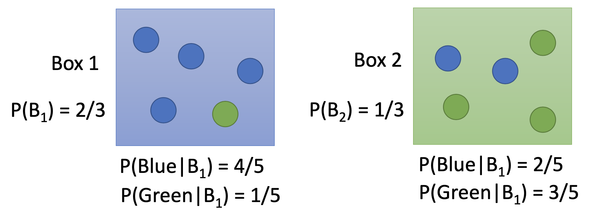
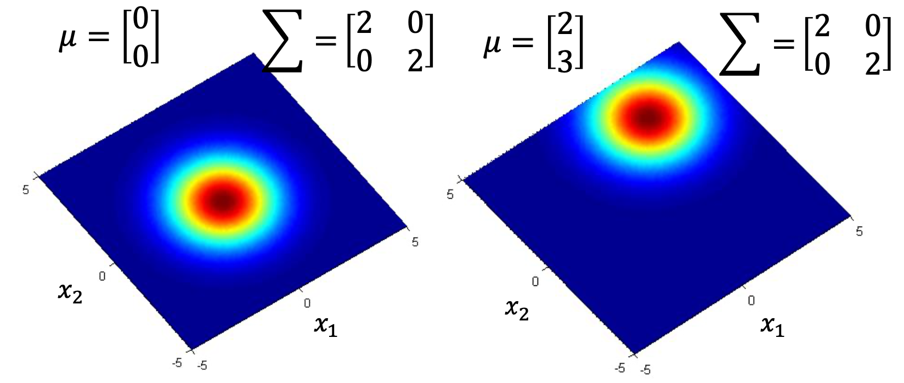

# 分类 (1)

## 主要内容

二分类；依概率生成 (分类) 模型 (Probabilistic Generative Model)

## 新名词

依概率生成 (分类) 模型 (Probabilistic Generative Model)

## 我的关注点

1. 分类 (classification) 的任务：就是找一个函数 $$f$$，对于某一个输入 $$x$$ 有
   $$
   f(x)={\rm Some\ Class}\ n
   $$
   分类的应用：

   - 信任评分 (例如银行根据客户收入、存款、年龄、职业等 feature 评估是否贷款给他，是二分类)
   - 诊断病症 (输入病友的症状、年龄、性别、疾病史，来判断得的是甚么病症，是 $$n$$-分类)
   - 手写数字 / 脸部识别等

2. **【复习】**贝叶斯公式：假设对象 $$A$$ 有可能取自类别 $$B_1, B_2, ..., B_n$$，则给定一个 $$A$$，它属于 $$B_i$$ 的概率是：
   $$
   \begin{aligned}
   P(B_i|A)
   &=
   \frac
   {P(AB_i)}
   {P(A)}
   \\
   &=
   \frac
   {P(AB_i)}
   {P(AB_1)+P(AB_2)+...+P(AB_n)}
   \\
   &=
   \frac
   {P(A|B_i)P(B_i)}
   {\sum_{j=1}^{n}{P(A|B_j)P(B_j)}}
   \\
   \end{aligned}
   $$
   假设有两个盒子 Box 1，Box 2，有蓝球、绿球的分布如图：

   

   根据贝叶斯公式，给定一个**蓝色的球** $$x$$，它属于 Box 1 的概率为：
   $$
   \begin{aligned}
   P({\rm Box\ 1}|x)
   &=
   \frac{P({\rm Box\ 1}, x)}{P(x)} \\
   &=
   \frac{P(x | {\rm Box\ 1})P({\rm Box\ 1})}{P(x|{\rm Box\ 1})P({\rm Box\ 1})+P(x|{\rm Box\ 2})P({\rm Box\ 2})} \\
   &=
   \frac{4/5\cdot 1/2}{4/5\cdot 1/2 + 2/5 \cdot 1/2} \\
   &= 2/3
   \end{aligned}
   $$

3. 【**复习**】多维度的**高斯分布**函数 (Gaussian Distribution)：
   $$
   f_{\mu,\Sigma}(x)=
   \frac{1}{(2\pi)^{D/2}}
   \frac{1}{|\Sigma|^{1/2}}
   e^{-\frac{1}{2}(x-\mu)^T\Sigma^{-1}(x-\mu)}
   $$

   - 输入：向量 $$x \in {\mathbb R}^d$$

   - 输出：向量 $$x$$ 的概率密度

   - 函数的参数：均值 (mean) $$\mu \in {\mathbb R}^d$$，协方差矩阵 (covariance matrix) $$\Sigma \in {\mathbb R}^{d\times d}$$。

   - $$\mu$$ 和 $$\Sigma$$ 影响一个高斯分布的 shape。例如，对 2 维的高斯分布，两组不同的 $$\mu$$ 和 $$\Sigma$$ 所对应的高斯分布，随输入向量的 $$x$$ 的两个维 $$x_1$$ 和 $$x_2$$ 的变化，在空间上的分布图像：

     

     可以看到，$$\mu$$ 和 $$\Sigma$$ 能影响高斯分布的位置。$$\mu$$ 和 $$\Sigma$$ 亦能影响高斯分布的形状 (图略)。

4. **依概率生成 (分类) 模型** (Probabilistic Generative Model)：

   - **目标**：(用概率论的方法) 找一个最能拟合当前训练数据 $$x_1, x_2, ..., x_n$$ 的模型，用这个模型去对新模型进行预测

   - **任务**：有一批训练数据：$$x_1, x_2, ..., x_n$$，希望找到这样一个概率分布函数 $$f(x)$$，使得用 $$f(x)$$ 能够生成出这一批训练数据 $$x_1, x_2, ..., x_n$$ 的几率在所有可能的 $$f(x)$$ 中是最大的

   - 一般，找可能的 $$f(x)$$ 都是在特定的一类分布中找的，例如高斯分布

   - **方案** (以二分类为例，即种类只有两种 $$C_1, C_2$$)：

     **(1)**   先对每一个种类 $$C_1, C_2$$，都去找一些训练样本 $$x_1, x_2, ..., x_n$$ (不同种类的 $$n$$ 可能不一样)。

     **(2)**   **对于每个类型** $$C_i$$，做如下操作：

     - 定义一个「Likelihood 函数」
       $$
       L(f)=f(x_1)f(x_2)...f(x_n) \tag{1}
       $$
       这一个函数能够描述「$$f(x)$$ 能够完全 Sample 出样本 $$x_1, x_2, ..., x_n$$」的可能性

     - 假设这批训练数据是从一个 $$n$$ 维高斯分布 $$f_{\mu,\Sigma}(x), x \in \mathbb R^d$$ 中 Sample 出来的。

       这时，**任务**变成：有一批训练数据：$$x_1, x_2, ..., x_n$$，希望找到这样一个概率分布函数 $$f_{\mu, \Sigma}(x)$$，使得 $$L(f_{\mu,\Sigma})=L(\mu,\Sigma)$$ 最大

     - 设 $$L(\mu,\Sigma)$$ 最大时 $$\mu,\Sigma$$ 分别等于 $$\mu^*,\Sigma^*$$，
       $$
       \mu^*,\Sigma^*=\arg \max_{\mu,\Sigma}L(\mu,\Sigma) \tag{2}
       $$

     - 根据统计学的知识，对于 $$n-$$维高斯分布 $$f_{\mu,\Sigma}(x), x \in \mathbb R^n$$ 而言，
       $$
       \begin{align}
       \mu^*&=\frac{1}{n}\sum_{i=1}^{n}x_i \tag{3}\\
       \Sigma^*&=\frac{1}{n}\sum_{i=1}^{n}(x_i-\mu^*)(x_i-\mu^*)^T \tag{4}
       \end{align}
       $$
       可以发现：$$\mu^*$$ 是各 $$x_i$$ 每一维度都取均值后得到的向量
       
     - 于是，便找到了类型 $$C_i$$ 在高斯分布下最优的模型：$$f_{\mu^*,\Sigma^*}(x)^{(i)}$$。

       用该模型对某个**新数据** $$x_N$$ 求出的值，就是「类型 $$C_i$$ 中能够抽出数据 $$x_N$$ 的概率表示值」，即「先验概率的表示值」：
       $$
       P(x_N|C_i)=f_{\mu^*,\Sigma^*}(x_N)^{(i)} \tag{5}
       $$

     **(3)**   当计算完两种类型的「概率表示值」后，用贝叶斯公式，就可以算出新样本所属类别的「后验概率」：即，**新数据** $$x_N$$ 属于类型 $$C_i$$ 的概率 $$P(C_i|x_N)$$：
     $$
     \begin{aligned}
       P(C_i|x_N)
       &=
       \frac{P(C_i,x_N)}{P(x_N)} \\
       &=
       \frac{P(x_N|C_i)P(C_i)}{P(x_N|C_1)P(C_1)+P(x_N|C_2)P(C_2)}\\
       \end{aligned} \tag{6}
     $$
     当「后验概率」$$P(C_i|x_N)$$ 的计算值 $$>0.5$$ 时，认为新数据 $$x_N$$ 属于类别 $$C_i$$。

   - **优化**：为了减小 overfitting 的可能性，通常会有意识地减少参数的个数。

     较常用的做法是对于两个类别 $$C_1, C_2$$，共享同一个协方差矩阵 $$\Sigma$$。
     $$
     \begin{align}
     \mu_1^*&=\frac{1}{n_1}\sum_{i=1}^{n_1}x_{1,i} \tag{7.1}\\
     \mu_2^*&=\frac{1}{n_2}\sum_{i=1}^{n_2}x_{2,i} \tag{7.2}\\
     \Sigma^*&=\frac{n_1}{n_1+n_2}\Sigma_1+\frac{n_2}{n_1+n_2} \tag{7.3}\Sigma_2
     \end{align}
     $$
     即，$$\mu_1^*,\mu_2^*$$ 的计算方法和公式 $$(3)$$ 的方法一致，而 $$\Sigma^*$$ 的算法是将计算好的各类的 $$\Sigma_i^*$$ 做**加权求和**。

5. 上述「依概率生成 (分类) 模型」，**采用了 $$n-$$维度的高斯分布**，是考虑了每一个 $$x_i$$ 的不同 feature (即 $$x_{i,1}, x_{i,2}, ..., x_{i,n_i}$$) 之间亦**存在某种「关联」才使用的高维分布**。

   如果断定 $$x_i$$ 的**不同 feature (即 $$x_{i,1}, x_{i,2}, ..., x_{i,n_i}$$) 之间不存在任何「关联」** (independent)，则先验概率的表示值 (公式 $$(5)$$) 可以写成：
   $$
   \begin{align}
   P(x_i|C_i)=P(x_{i,1}|C_i)P(x_{i,2}|C_i)...P(x_{i,n_i}|C_i)
   \end{align}
   $$
   即，断定了不同 feature 之间为独立，就可以直接将特征向量的每一维度的先验概率拆开。

   而 $$P(x_{i,1}|C_i),P(x_{i,2}|C_i),...,P(x_{i,n_i}|C_i)$$ 都是 **1 维度的概率表达式，可以取自 1 维分布**，如 $$N(\mu, \sigma^2)$$。

   这方法称为「**朴素贝叶斯分类器** (Naive Bayes Classifier)」

6. 依概率生成 (分类) 模型的**后验概率的标准化** (以 $$P(C_1|x)$$ 为例)：
   $$
   \begin{align}
   P(C_1|x)&=\frac{P(x|C_1)P(C_1)}{P(x|C_1)P(C_1)+P(x|C_2)P(C_2)}\\
   &=\frac{1}{1+\frac{P(x|C_2)P(C_2)}{P(x|C_1)P(C_1)}}\\
   &=\frac{1}{1+e^{-z}}\\
   &={\rm sigmoid}(z) \tag{8}
   \end{align}
   $$
   其中，
   $$
   z=\ln\frac{P(x|C_1)P(C_1)}{P(x|C_2)P(C_2)}\tag{9}
   $$

   - 如果在二分类问题中，将协方差矩阵「$$\Sigma$$」归一化成 $$(7.3)$$ 的形式，$$z$$ 将可以被写成：
     $$
     \begin{aligned}
     z
     =
     &[(\mu_1-\mu_2)^T\Sigma^{-1}x] \\
     &-\frac{1}{2}\mu_1^T\Sigma^{-1}\mu_1+\frac{1}{2}\mu_2^T\Sigma^{-1}\mu_2+\ln\frac{N_1}{N_2}
     \end{aligned} \tag{10}
     $$
     设：
     $$
     \begin{align}
     {\boldsymbol w}^T&=(\mu_1-\mu_2)^T\Sigma^{-1}x \tag{11}\\
     b&=-\frac{1}{2}\mu_1^T\Sigma^{-1}\mu_1+\frac{1}{2}\mu_2^T\Sigma^{-1}\mu_2+\ln\frac{N_1}{N_2} \tag{12}\\
     \end{align}
     $$
     因此：
     $$
     \begin{align}
     z={\boldsymbol w}^T{\boldsymbol x}+b \tag{10$^\prime$} \\
     \end{align}
     $$
     从而后验概率写作：
     $$
     P(C_1|x)={\rm sigmoid}({\boldsymbol w}\cdot{\boldsymbol x}+b) \tag{8$^\prime$}
     $$

   - 公式 $$(8^\prime)$$ 是后验概率的**标准化**形式。

     - 在**依概率生成 (分类) 模型**中，如果模型被认为是 $$n-$$维高斯分布，则只需要根据样本求出或者估计 $$N_1, N_2, \mu_1, \mu_2, \Sigma$$，就可以利用公式 $$(11)$$ 求出 $$\boldsymbol w$$ 和 $$b$$。
     
     - 其他分布，只要是所谓「指数族分布」，就都可以求出 $$\boldsymbol w$$ 和 $$b$$，从而求出后验概率 [^1]。
    
     - 化成「标准化」形式后，参数就变成了「$$\boldsymbol w$$ 和 $$b$$」；只需求出「$$\boldsymbol w$$ 和 $$b$$」，整个分布就确定了。
     
       而**在生成模型中**，「$$\boldsymbol w$$ 和 $$b$$」的值**只能经过训练样本配合分布函数求得**，而**不能**透过梯度下降调整模型后得到。
   
7. **依概率生成 (二分类) 模型**的总结：

   - 前提：知晓**样本**应该取自哪种品种的分布 (比如高斯分布)，得到它的分布函数 $$f$$
   - 训练模型：
     - 输入：两种类别**各一批**样本
     
     - 输出：
     
       根据**每一组**样本生成的、参数的拟合效果最佳的、基于分布函数 $$f$$ 的 **2 个「后验概率」表达式** $$P(C_i|x)$$ (即模型；每一个分类对应一个后验概率表达式，即每个分类对应一组 $${\boldsymbol w}, b$$ )
     
       对于大多数拟合方式，「后验概率」可以表达为一个与一组参数 $$\boldsymbol w$$ 和 $$b$$ 相关的函数：
       $$
       P(C_i|x)=f_{{\boldsymbol w}, b}({\boldsymbol x})={\rm sigmoid}({\boldsymbol w}\cdot{\boldsymbol x}+b)
       $$
   - 使用模型：
     - 输入：一个**新样本**
     - 输出：该**样本属于某个类型的「后验概率」$$ P(C_i|x)$$ 值**，若 $$>0.5$$ 表示属于该类

## 派生问题

1. 公式 $$P(x_N|C_i)=f_{\mu^*,\Sigma^*}(x_N)^{(i)}$$ 直接把概率和「概率密度的值」划等号，合理吗？

[^1]: https://blog.csdn.net/hwcptbtptp/article/details/84975994