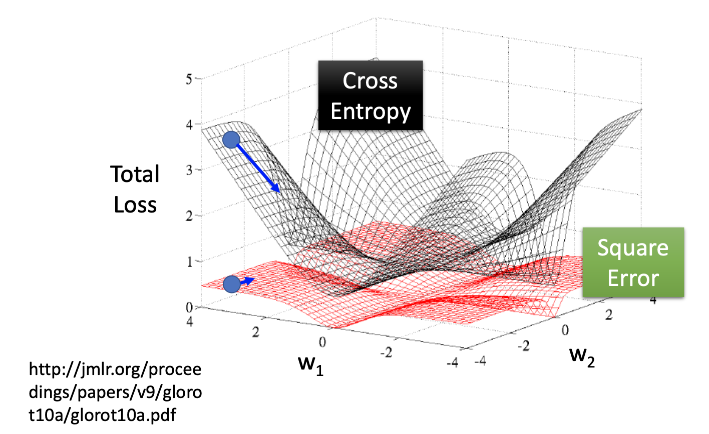
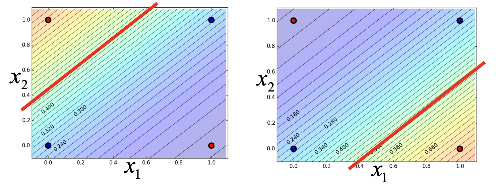
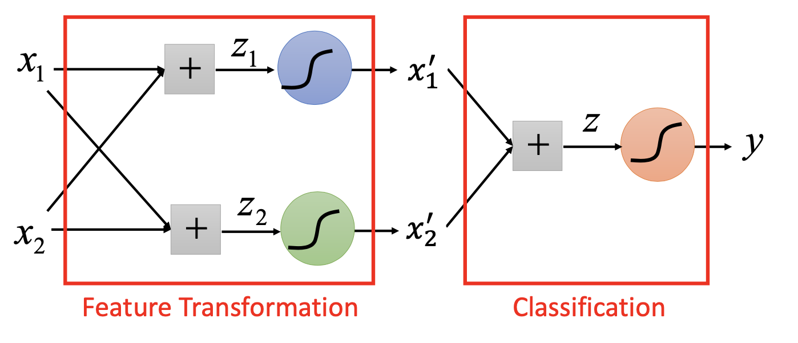
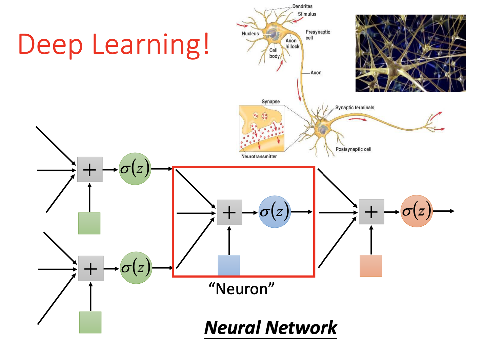

# 分类 (2)

## 主要内容

逻辑回归 (Logistic Regression)；判别模型 (Discriminative Model)；多分类 (Multi-Class Classification)

## 新名词

逻辑回归 (Logistic Regression)；判别模型 (Discriminative Model)；

## 我的关注点

1. **逻辑回归** (Logistic Regression)：

   不同于**线性回归**，**逻辑回归**是在空间中找到一个「**决策边界**」以完成分类的决策[^1]

   **逻辑回归**是用来进行分类的；线性回归可以「预测」连续的值，但是不能解决分类问题

   线性回归是在**概率分布模型不清楚**的情况下，硬性拟合出一条直线的回归方式 [^2]

   - **逻辑回归模型**一般使用**交叉熵** (cross entropy) 函数作为损失函数：

     首先，Likelihood 函数写作 (假设： $$f_{{\boldsymbol w},b}(\cdot)$$ 是根据类型「$$C_1$$」进行设计的，且样本 $$x_3$$ 的类别是 $$C_2$$)：
     $$
     L({\boldsymbol w},b)=f_{{\boldsymbol w},b}(x_1)f_{{\boldsymbol w},b}(x_2)(1-f_{{\boldsymbol w},b}(x_3))...f_{{\boldsymbol w},b}(x_n) \tag{1}
     $$
     因此，使模型 $$f_{{\boldsymbol w},b}(\cdot)$$ 拟合最好的参数可以写作：
     $$
     {\boldsymbol w}^*,b^*=\arg\max_{{\boldsymbol w},b}L({\boldsymbol w},b)
     $$
     或者等价地写作：
     $$
     {\boldsymbol w}^*,b^*=\arg\min_{{\boldsymbol w},b}[-\ln L({\boldsymbol w},b)]=\arg\min_{{\boldsymbol w},b}\mathcal L({\boldsymbol w},b)\tag{2}
     $$
     经过一番奇怪的运算后，可以发现：
     $$
     -\ln L({\boldsymbol w},b)=\sum_n-[\hat y_n\ln f_{{\boldsymbol w},b}({\boldsymbol x_n})+(1-\boldsymbol {\hat y}_n)\ln (1-f_{{\boldsymbol w},b}({\boldsymbol x_n}))]
     $$
     令
     $$
     C(f({\boldsymbol x_n}), {\hat y})=-[\hat y_n\ln f({\boldsymbol x_n})+(1-\boldsymbol {\hat y}_n)\ln (1-f({\boldsymbol x_n}))] \tag{3}
     $$
     因此，模型 $$f_{{\boldsymbol w},b}(\cdot)$$ 的**损失函数**等价于下列形式：
     $$
     \mathcal L(f)=\sum_nC(f(x^{(n)}), \hat y^{(n)}) \tag{4}
     $$
     其中，$$C(f(x^{(n)}), \hat y^{(n)})$$ 即是两个伯努利分布 (Bernoulli distribution) $$p$$ 和 $$q$$ 之间的**交叉熵函数**：
     $$
     \begin{align}
     p&=
     \begin{cases}
     \hat y^n &(x=1)\\
     1-\hat y^n &(x=0)\\
     \end{cases}\\
     q&=
     \begin{cases}
     \hat f({\boldsymbol x_n}) &(x=1)\\
     1-f({\boldsymbol x_n}) &(x=0)\\
     \end{cases}
     \end{align}
     $$
     附：**交叉熵函数**的定义：两个函数 $$p$$ 和 $$q$$ 之间的**交叉熵**定义为：
     $$
     C(p,q)=-\sum_xp(x)\ln(q(x)) \tag{5}
     $$

   - 根据**交叉熵函数**所定义的梯度下降形式跟**均方误差**定义的梯度下降方案一致 (*推断略去*)：
     $$
     w^{(i+1)} = w^{(i)}-\eta \sum_n -(\hat y_n-f_{{\boldsymbol w},b}({\boldsymbol x}_n))x_n^i \tag{6}
     $$

   - **逻辑回归**、**线性回归**的比较：

     | 项目                                              |                     Logistic Regression                      |                      Linear Regression                       |
     | ------------------------------------------------- | :----------------------------------------------------------: | :----------------------------------------------------------: |
     | 模型表达式                                        | $$f_{{\boldsymbol w},b}({\boldsymbol x})={\rm sigmoid}({\boldsymbol w}\cdot{\boldsymbol x}+b)$$ | $$f_{{\boldsymbol w},b}({\boldsymbol x})={\boldsymbol w}\cdot{\boldsymbol x}+b$$ |
     | Step 1 $$f({\boldsymbol x})$$ 的输出 (预测值) |                         介乎 0 至 1                          |                       任何可能的预测值                       |
     | Step 2 损失函数 $$\mathcal L(f)$$ 的计算      |     $$\mathcal L(f)=\sum_nC(f(x^{(n)}), \hat y^{(n)})$$      |     $$\mathcal L(f)=\sum_n(f(x^{(n)}), \hat y^{(n)})^2$$     |
     | 真值 $$\hat y^{(n)}$$ 的值                        |    对于二分类，$$\hat y^{(n)}=0$$ 或者 $$\hat y^{(n)}=1$$    |               $$\hat y^{(n)}$$ 可以是任何实数                |
     | Step 3 梯度下降的过程                        |                          $$(6)$$ 式                          |                          $$(6)$$ 式                          |

   - 逻辑回归不适用均方误差的原因：

     

     在 Logistic Regression 中，利用均方误差的话误差下降的过程**过于平缓**，存在高原地区，容易发生梯度消失从而提前收敛。

2. **判别模型** (Discriminative Model)：

   - 生成模型 (Generative Model) 是「预先确定了分布样式，**整个模型的形状依赖于训练样本所确定的概率分布**」的模型；

     判别模型 (Discriminative Model) 是「未确定分布样式，从而**整个模型的形状全部依赖于训练样本**」的模型。

   - 生成模型、判别模型的函数形式一样，但是参数不一样。二者是一组相同的训练数据，经过不同的训练方法，汇总不同的资讯，最终得到不同效果的模型

   - **生成模型**和**判别模型**的对比：

     | 项目                             | 生成模型 (Generative Model)                                  | 判别模型 (Discriminative Model)                          |
     | -------------------------------- | ------------------------------------------------------------ | -------------------------------------------------------- |
     | $${\boldsymbol w},b$$ 的获取方式 | 将样本 fit 进事先**假定**的**概率分布**，由样本所确定的概率分布的形状，间接求得 $${\boldsymbol w},b$$ | 直接透过**样本学习** + **梯度下降**习得                  |
     | 模型训练成果的「来源」           | 样本 + 人为假定的**概率分布** (如高斯分布)                   | 完全来自于样本                                           |
     | 优点                             | **- 人为假定了**样本所来自的概率分布，因此**数据量比较少**的时候，也能估计得相对准确； - 由于结果不完全来自于样本，因此样本中含有的**「噪声」对其拟合结果影响不太大**。 - **先验概率和其他样本数据**可以来自不同的数据源，分别拟合 | 训练结果完全忠实于样本数据，对于数据量大的时候比较准确。 |

3. **多分类** (Multi-Class Classification)：

   受启发于二分类的方案，在训练时，对于每一个种类 $$C_i,\ i \in \{1,2,...,M\}$$ 都用与之前相同之方法求一个 $$z$$ (每一个 $$z$$ 对应一组 $${\boldsymbol w}, b$$)：
   $$
   \begin{aligned}
   C_1:{\boldsymbol w}_1, b_1 \qquad &z_1={\boldsymbol w}_1\cdot {\boldsymbol x} + b_1 \\
   C_2:{\boldsymbol w}_2, b_2 \qquad &z_2={\boldsymbol w}_2\cdot {\boldsymbol x} + b_2 \\
   ...\qquad&\\
   C_M:{\boldsymbol w}_M, b_M \qquad &z_M={\boldsymbol w}_M\cdot {\boldsymbol x} + b_M \\
   \end{aligned}
   \tag{7}
   $$
   **而模型在使用时，实际计算出的 $$z_i$$ 的大小反映了系统对「输入 $$x$$ 被分类为 $$C_i$$」这件事的「评分」**；这时候将 $$z_1, z_2, ..., z_M$$ 汇总起来，用 softmax 函数进行归一化：
   $$
   \begin{aligned}
   y_i &= {\rm softmax}(z_i)\\
   &=e^{z_i}/\sum_{j=1}^Me^{z_j}
   \end{aligned}\tag{8}
   $$
   经过 softmax 函数归一化后，$$y_i$$ 的值反映了「评分 $$z_i$$ 的相对大小」；而且有如下事实成立：
   $$
   \sum_{i=1}^My_i=1
   $$
   基于这一特点，实际使用模型进行计算时，$$y_i$$ 将可以表示输入 $$x$$ 被分类为 $$C_i$$ 的**几率**。

4. **多分类模型**的总结：

   - 前提：根据实际情况明确到底是使用 Generative Model 还是 Discriminative Model。选择不合适的模型也可以拟合出结果，但是效果会不好

   - 训练模型 (假设有 $$M$$ 个可选的种类 $$C_1, C_2, ..., C_M$$ )：

     - 输入：各种类别**各一批**样本，一共 $$M$$ 批样本；第 $$i$$ 批样本共含有 $$n_i$$ 个样本

     - 处理：

       - 对于每一个种类 $$C_i$$ 及其样本，依照选择的是生成模型或是判别模型，求出当前的参数 $${\boldsymbol w}_i$$ 及 $$b_i$$，并将样本喂入模型中，依照当前参数 $${\boldsymbol w}_i$$ 及 $$b_i$$，计算 $$z_i$$ 函数值；

       - 计算完所有 $$z_1, z_2, ..., z_M$$ 函数值后，用 sigmoid 做归一化，求出 $$y_1, y_2,...,y_M$$；

       - 针对真实值 $$\hat y_1, \hat y_2,...,\hat y_M$$ 利用交叉熵误差函数
         $$
         \mathcal L=-\sum_{i=1}^M \hat y_i\ln y_i
         $$
      进行**梯度下降**，得到新的 $$M$$ 组 $${\boldsymbol w}$$ 及 $$b$$，直到误差降到最低。
   
  - 输出：
   
       $$M$$ 组 $${\boldsymbol w}$$ 及 $$b$$ 的值所确定的 $$M$$ 个 $$z_i$$ 函数
   
   - 使用模型：
   
     - 输入：一个**新样本** $$\boldsymbol x$$ 
     - 处理：利用 $$M$$ 个 $$z_i$$ 函数逐一计算 $$z_i$$ 的值，并做归一化，得到预测值 $$y_1, y_2,...,y_M$$
     - 输出：结论 —— **新样本** $$\boldsymbol x$$ 所属的类别是「预测值 $$y_1, y_2,...,y_M$$ 中最大概率的那一项 $$y_m$$ 」所对应的类别 $$C_m$$

5. 逻辑回归的缺陷：

   - 只能在空间上找到一个「决策边界」，它是线性的、平缓的，有时分类做得比较粗糙：

     

     对于上图这样的红色、蓝色各在一个对角线上的情况，单靠逻辑回归没有办法拟合出一个完备的分类方法，因为 2 维度的逻辑回归结果是一条**直线**，无法做到用一条直线完全分隔开两种颜色的点点。

     因此，一层逻辑回归太「直」了，不好用。

   - 通常，可以层叠 (cascade) 多个逻辑回归模型，以使整个模型更复杂，拟合的能力更高：

     

     比如上面就是平行层叠了两个逻辑回归模型。

   - 多个模型进行层叠操作，就有本事称之为神经网络 (Deep Learning)：

     

## 派生问题

1. $$(6)$$ 式的推导还需要进一步研究，总感觉有点奇怪；而且没有正则化项目

[^1]: https://blog.csdn.net/jiaoyangwm/article/details/81139362
[^2]: 我是这么认为的～