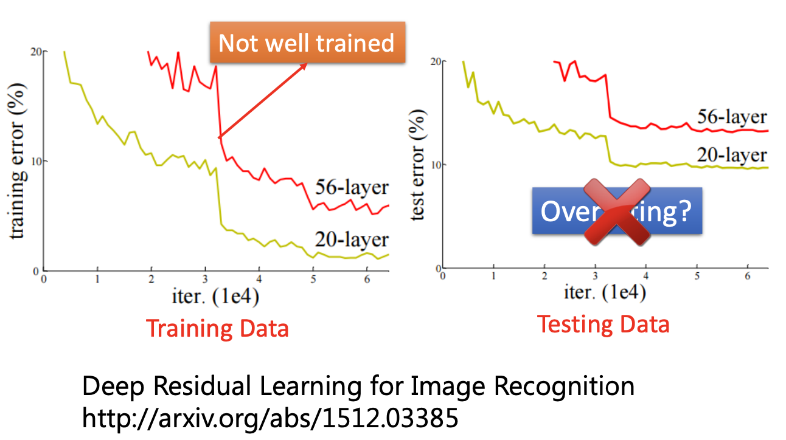

# 深度学习 (引入)

## 主要内容

深度学习 (引入)

## 新名词

(此处暂无)

## 我的关注点

1. 进行「**深度学习**」的 5 个基本步骤：

   **(1)**   建立神经网络 (Neural Network) 框架 —— 即定义了一个函数集 (Function Set)；

   **(2)**   评价框架好坏；

   **(3)**   找到当前 Function Set 中最好的函数 (利用 GD 方法进行调整参数)；

   **(4)**   用选出的 function 在「**训练集 (Training Data)**」上做测试，如果该 function 未能在训练集上取得良好成果，说明**模型坏了**，需要重新开始第 (1) 步；

   **(5)**   继续用选出的 function 在「**测试集 (Testing Data)**」上做测试，如果该 function 未能在训练集上取得良好成果，说明**发生了 Overfitting**，需要重新开始第 (1) 步。如果指标正常，模型便可以使用。

2. 神经网络的**层数**，是依靠工程人员自己的「尝试」和「直觉」，或是在「Evolutionary Artificial Neural Networks」中由系统自己判断而确定的

3. 不是网络层数越深，网络就越好

4. 「隐藏层」可以看作一个「特征提取器」，Softmax 层可以看作一个「分类器」

5. Universality Theorem

   任意一个连续函数：
   $$
   f:\mathbb R^N \rarr \mathbb R^M
   $$

   都能够被一个含有 1 个隐藏层、神经元足够的神经网络表达出来

6. 如果模型 A 在**测试集**上的效果比模型 B 的效果差，不能说明是模型 A 发生了 Overfitting。

   例如，模型 A 为 56 层神经网络，而模型 B 为 20 层神经网络，而在**测试集**上模型 A 效果次于模型 B，**不能说明 56 层的模型 A 发生了 Overfitting**。还要比较双方在**训练集**上的效果。

   如果训练集上本来模型 A 就比模型 B 效果差，说明模型 A 本身**因训练欠佳 (Not Well-Trained) 而未能使用**，而不能说模型 A 发生了 Overfitting：

   

## 派生问题

(此处暂无)