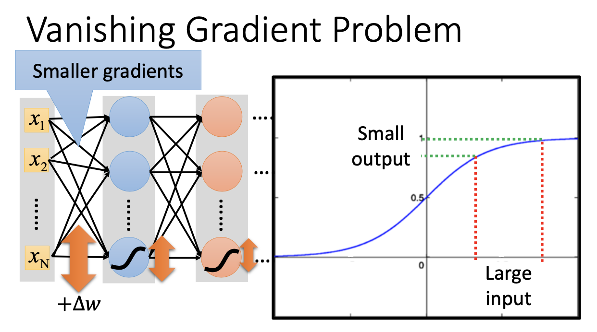
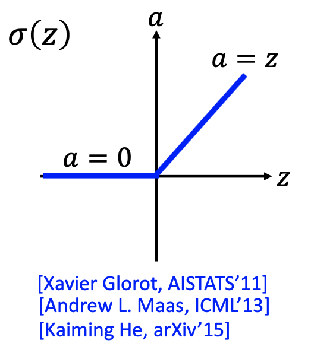
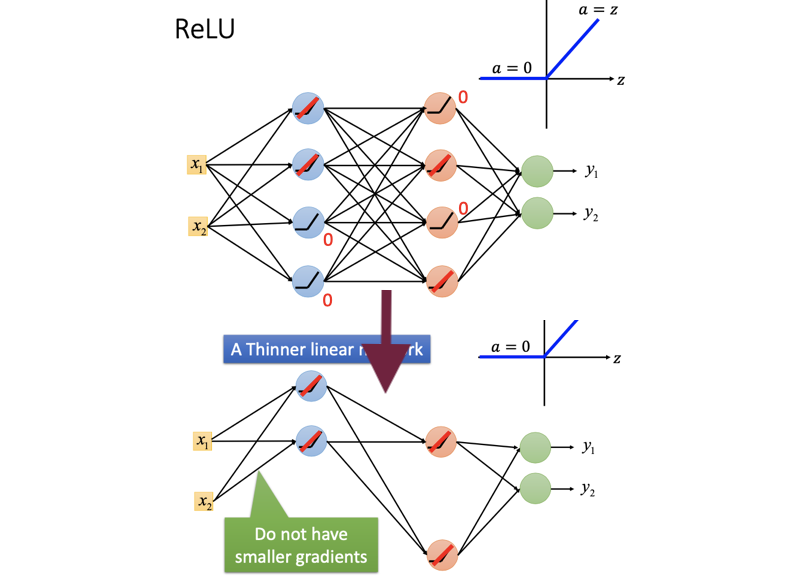
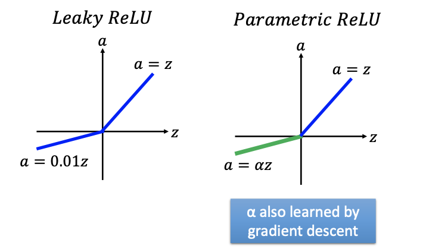
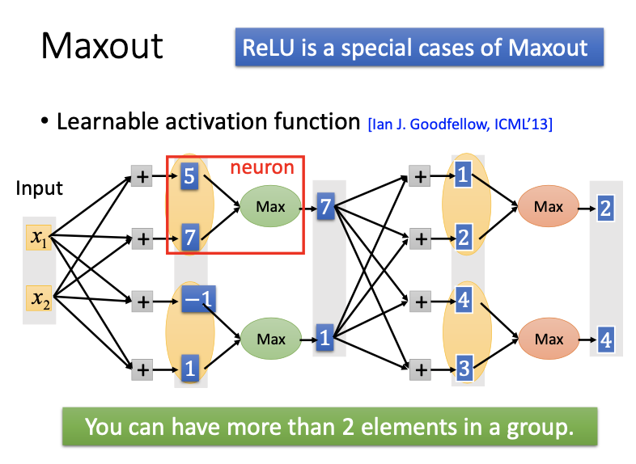
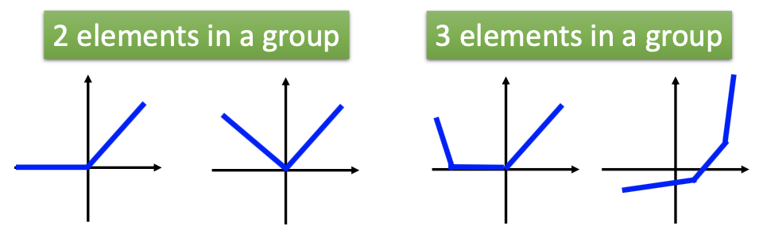
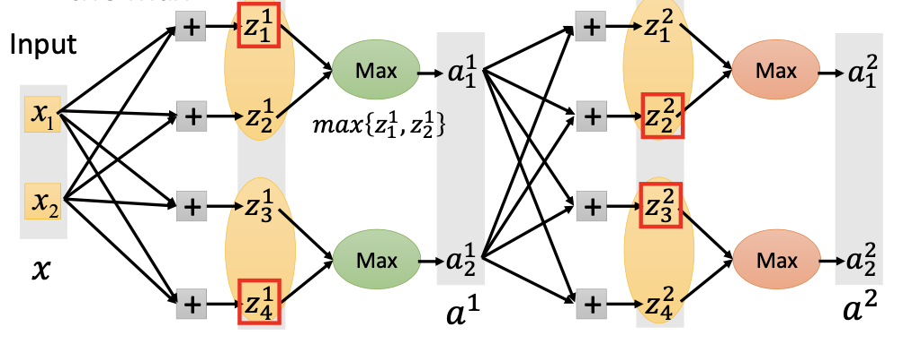
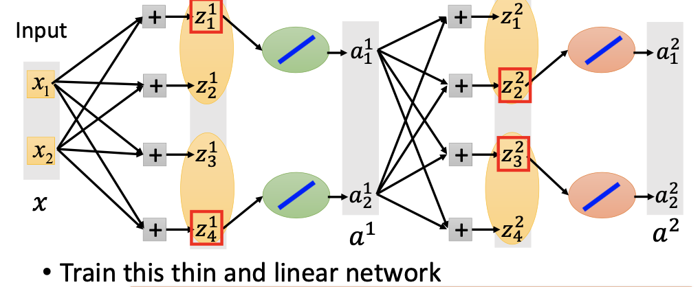
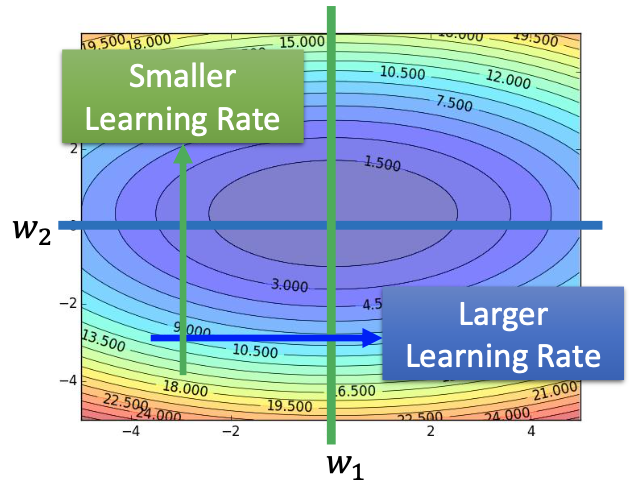

# 深度学习 (技巧及手段 上)

## 主要内容

深度学习 (技巧及手段 - 上)；激活函数和学习率的优化；ReLU；Maxout；Momentum

## 新名词

梯度消失 (Vanishing Gradient Problem)

## 我的关注点

1. **梯度消失**问题 (Vanishing Gradient Problem)：

   - 现象描述：

     神经网络现使用的是 **Sigmoid** 函数。

     当神经网络层数增加后，在调整参数 (Optimize) 时，**靠近输入层的那些参数**因为离输出层比较远 (称为 「远端参数」)，因此会经过很多次激活函数 (Sigmoid)，而每经过一次 Sigmoid，它们**对后边值的影响就会被减小一些**。

     经过多层神经网络后，可预见的现象是：每一次更新参数的时候，这些**「远端参数」对总误差的贡献**，**会在途中的那些激活函数的作用下减到很小**，当误差传到输出层的时候，这些**参数对总误差的导数值**会被减弱到接近于 0。

     导数值接近于 0，会令这些「远端参数」**一直都更新得很缓慢**，因此训练很多次后，这些参数跟初始值 (随机的值) 相比，没有太大的变化。

     既然参数没有太大变化，因此导致采用这些参数的神经元实质上不起任何**积极的作用**。该现象称为「梯度消失」。

     

     如上图所示：

     即使当 input 的***变化***很大 (图中的 Large input) 时，经过 Sigmoid 函数 output 的***变化***也会被减小到非常小。因此 Sigmoid 函数起到一个「减小器」的作用。

     不仅如此，这个***变化***在中间还要通过若干个 Sigmoid 函数，因此
     $$
     \frac{\partial C}{\partial w} \approx \frac{\Delta C}{\Delta w}\qquad {\rm where\ }C{\rm\ is\ total\ loss}
     $$
     会被这若干个 Sigmoid 函数搞得很小很小。

   - 产生原因：经过若干个激活函数作用后，「远端参数」对总误差的梯度会被减到很小 (接近于 0)。

   - 解决方案：更换新的激活函数 ReLU

2. **ReLU** (Rectified Linear Unit，修正线性单元) **激活函数**：

   

   - 采用 ReLU 的原因：

     - 削除「梯度消失」的影响，因为它的导数为恒定值，没有「把输出值压在 0 至 1」这种行为
     - 计算速度快
     - 「仿生学原因 (Biological Reason)」

   - 采用 ReLU 函数，原网络就变成了一个规模更小、没有激活函数的「线性网络」：

     

     「新网络」就是将「原网络中所有输入值为负的神经元」剔除掉的、规模更小的网络。

   - ReLU 的两种变体：Leaky ReLU，Parametric ReLU

     

     其中，Leaky ReLU 中人为写死了当输入值 $$<0$$ 时的斜率，而 Parametric ReLU 中此等斜率会被当作神经网络的一个**参数**，而该等参数的值可以经过若干次迭代而被**学习出来**。

   - ReLU 函数是 Maxout 函数的一种***特殊情况*** (special case)

3. **Maxout 函数**：ReLU 的进化版，又称「Learnable Activation Function」

   - 主要结构：

     

     - 1 个激活函数，被拆成了由若干个**元素 (element)** 组成的 1 个**组 (group)**。

     - 每个元素都有一个输入，因此， 1 个激活函数 (即 1 个 group) 会有若干个输入。

     - 以前，每个前一层神经元的输出 (如输入层的 $$x_1, x_2, ..., x_n$$) 到每个本层神经元的激活函数有 1 组参数 ($$w,b$$)；

       现在，每个前一层神经元的输出到**每个 element** 都会有 1 组参数 ($$w,b$$)。

       如果 1 个激活函数被拆开成 $$n$$ 个 element，参数的数量就增加 $$n - 1$$ 个。

     - Maxout 函数的输出，就是本组中数值最大的 element 的值。

   - ReLU 就是组内只有 1 个 element 的 Maxout；

     或者是有组内有多个 element、但是只有 1 个 element 的 $$w,b$$ 不全为 0，其他 element 全为 0 的 Maxout

   - Maxout 的形状是「可以学习」的，很灵活：

     

     只需事先确定激活函数的「段数」，最终的形状将被网络自行学会。

   - Maxout 的训练流程：

     - 先确定每一个 group 的所有输入，并且找出哪一些 element 的值会被输出 (找到每个 group 的 max)：

       

     - 然后，从网络中剔除掉无关的 element，缩小网络规模：

       

       > - 图中，「linear network」指的是激活函数都可导的网络。因为网络中每一个 Maxout 在被剔除掉无关 element 之后，便相当于一个 $$y=x$$ 函数，是可导的。
       > - 只有线性网络才能用梯度下降。
       > - 其实 ReLU 的训练过程也如此，因为 ReLU 本身不可导，剔除无关神经元后就变成可导的 linear network 了。

     - 用普通方法训练「剔除了无关 element」的线性网络。

4. 自适应学习率的几种方案：

   - **Adagrad** [^1]：一种温和的学习率调整方案，适合梯度的空间分布比较均匀、规则的模型
     $$
     w^{(t+1)}=w^{(t)}-\frac{\eta}{\sqrt{\sum_{i=0}^t(g^{(i)})^2}}g^{(t)}
     $$

     - 其中 $$g^{(t)}$$ 是神经网络更新第 $$t$$ 次参数时，梯度 $${\partial C}/{\partial w^{(t)}}$$ 的值。

       该等方法使得梯度能在梯度下降缓慢 ($$g^{(t)}$$ 相对小，因此 $${\sqrt{\sum_{i=0}^t(g^{(i)})^2}}$$ 会相对以前的值更小) 的方向上适当提高学习率；

       而梯度下降快速 ($$g^{(t)}$$ 相对大，因此 $${\sqrt{\sum_{i=0}^t(g^{(i)})^2}}$$ 会相对以前的值更大) 的方向上适当降低学习率：

       

     - 但是，在深度学习的范畴中，往往无法遇到像上图这样规则的梯度变化图 (Error Surface)，而梯度变化在空间中的形状 (Error Surface) 都是很诡异很畸形的，用 Adagrad 可能无法 hold 住，需要用 **RMSProp** 方法。

   - **RMSProp**：一种在更新参数时，考虑了前一回更新参数时求得的梯度的方案

     - 方案：
       $$
       \begin{aligned}
       w^{(1)} &\larr w^{(0)} - \frac{\eta}{\sigma^{(0)}}g^{(0)}, \qquad
       \sigma^{(0)}=g^{(0)} \\
       w^{(2)} &\larr w^{(1)} - \frac{\eta}{\sigma^{(1)}}g^{(1)}, \qquad 
       \sigma^{(1)}=\sqrt{\alpha(\sigma^{(0)})^2+(1-\alpha)(g^{(1)})^2} \\
       w^{(3)} &\larr w^{(2)} - \frac{\eta}{\sigma^{(2)}}g^{(2)}, \qquad 
       \sigma^{(2)}=\sqrt{\alpha(\sigma^{(1)})^2+(1-\alpha)(g^{(2)})^2} \\
       &...\\
       w^{(t+1)} &\larr w^{(t)} - \frac{\eta}{\sigma^{(t)}}g^{(t)}, \qquad \sigma^{(t)}=\sqrt{\alpha(\sigma^{(t-1)})^2+(1-\alpha)(g^{(t)})^2} \\
       \end{aligned}
       $$
       每一个 $$\sigma^{(t)}$$ 项，就是所有 gradient 的均方根 (root mean square)，其中可以感觉到，越往前的 gradient 影响越弱。

     - 和 Adagrad 的区别：Adagrad 的 gradient 是「无差别」加和，而 RMSProp 的 gradient 经过了一轮「指数衰减」后才进行加和。

     - RMSProp 的优势：在神经网络一般是「非凸」的条件下，结果比 Adagrad 更好。

       在参数空间**更为平缓**的方向，RMSProp 会取得更大的进步（因为平缓，所以历史梯度平方和较小，对应**学习率下降的幅度较小**）；并且能够使得陡峭的方向变得平缓，从而加快训练速度。[^2]

## 派生问题

(此处暂无)

[^1]: 见笔记 20200831

[^2]: 某些专业的表达参考了 https://zhuanlan.zhihu.com/p/34230849