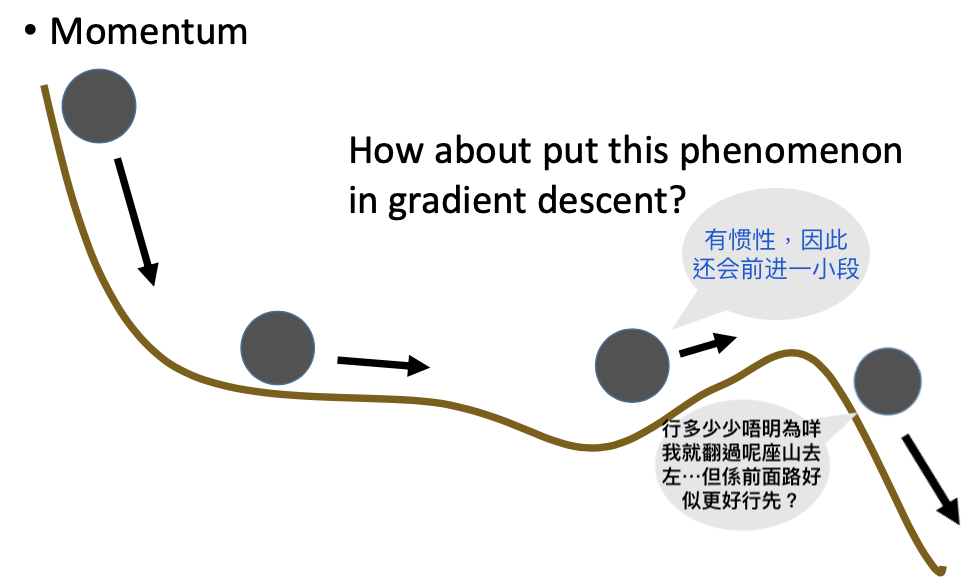
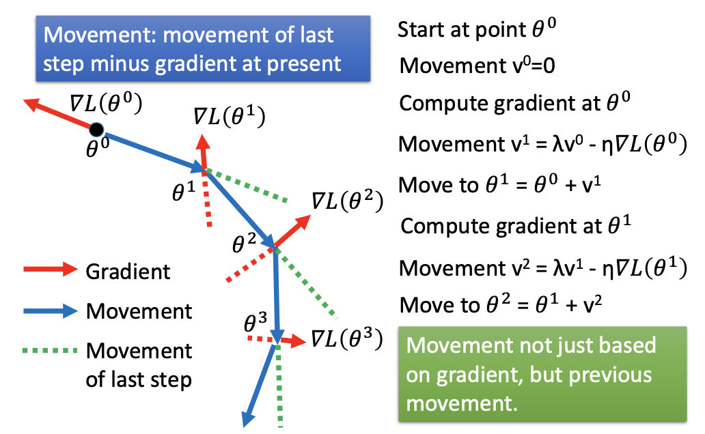
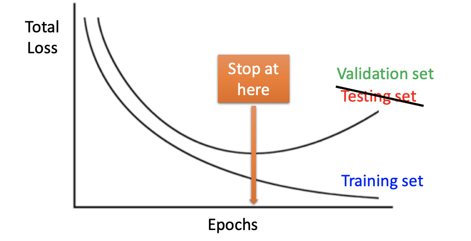
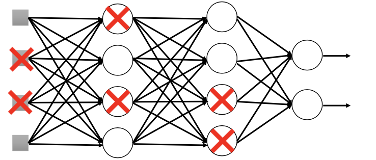
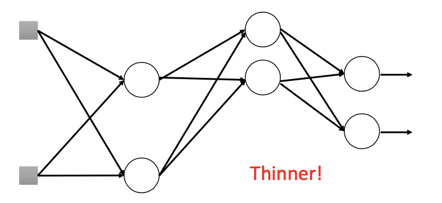
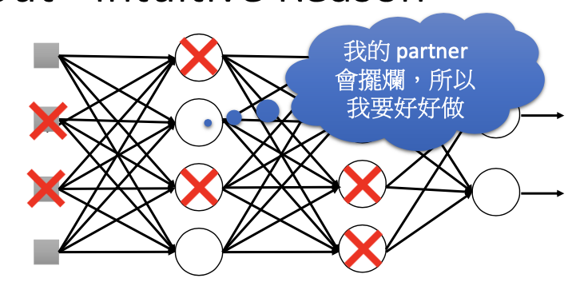

# 深度学习 (技巧及手段 下)

## 主要内容

深度学习 (技巧及手段 - 下)；Momentum；Adam；早停 (Early Stopping)；正则化 (Regularization)；扔掉 (Dropout) 算法

## 新名词

Dropout；Early Stopping；Adam；Momentum；Ensemble

## 我的关注点

5. **Momentum：惯性** (动量) —— 是一种 Gradient Descent 的升级版方案

   - 设立原因：

     - 利用梯度下降寻找最佳参数的过程可能遇到多种困难，例如「高原反应」「驻点」和「local minima」问题。

     - 在现实生活中，运动的物体存在动能 (这里理解为存在「惯性」)。运动的物体在上升 (重力势能增加) 的过程中，有一部分重力势能是由其动能转化而来的。

     - 可以设计一种方案，让参数在其梯度下降至 0 附近时不至于停止更新，而是让其 (根据之前的梯度状态) 多更新一些 —— 即「动能转化为势能」—— 没准可以「翻山越岭」，从而能够突破「local minima」或「驻点」等问题：

       

   - 惯性的表示式：
     $$
     v^{(t+1)}=\lambda v^{(t)} - \eta \nabla L(\theta^{(t)})
     $$
     其中，

     - $$v^{(t)}$$ 是第 $$t$$ 次更新参数 $$\theta$$ 时后，该参数的*惯性*值；
     - $$\lambda$$ 表示「当前运动状态」对惯性的影响值，作为神经网络的一个新参数；
     - $$\eta$$ 是学习率。

   - 把**惯性** Apply 到 Gradient Descent 中去的方法：

     - (1) 首先，从 0 状态的参数表列 $$\theta ^{(0)}$$ 开始，因为此时刚开始进行参数更新的操作，之前并没有任何参数更新的行为，因此没有产生*惯性*，因此*惯性* $$v^{(0)} = 0$$。
     - (2) 计算参数表列 $$\theta ^{(0)}$$ 关于总损失的梯度 $$\nabla L(\theta ^{(0)})$$。
     - (3) $$\star$$ **更新当前*惯性*值** (不是进行梯度下降！)：$$v^{(1)}=\lambda v^{(0)} - \eta \nabla L(\theta^{(0)})$$。
     - (4) 调整参数：$$\theta^{(1)} = \theta^{(1)} + v^{(1)}$$。
     - (5) 重复 (2) 至 (4) 步，直到参数收敛 (converge，$$\nabla L(\theta ^{(t)})\approx 0$$)。

     

     上图描述的是利用*惯性*进行参数更新过程的图像化的表示。**绿色虚线是「惯性建议的移动步伐」**，红色箭头是梯度的方向，而**红色虚线是「GD 理论建议的移动步伐」**。红、绿虚线向量和就是应该移动的方向及步长。

   - 要注意的是：*惯性*的存在并不能保证神经网络在收敛之处不是「local minima」，但是为神经网络能够收敛到「global minima」提供了一些「hope」。

6. **Adam**：是结合了 RMSprop 及 Momentum 技术，并且含有一些「正则化、normalization 手段」的梯度下降方案。现代的神经网络通常不用普通梯度下降，而都用 Adam 方法。

   Adam 方法需要提供的资讯包括惯性的影响因子 $$\lambda$$ 和学习率 $$\eta$$。

7. **Early Stopping**：一种能够提升「透过**训练集**训练的神经网络」在实际生产中应用水平的方案。

   - 提出原因：神经网络在**训练集**上的表现和**测试集**上的表现有所不同。

     随着 epoch 的增加，不断地优化神经网络后，在**训练集**上的效果会越来越好；但是当「优化得走火入魔」之后，可能会造成「Overfitting」，**测试集**上的效果将越变越差。

     海量实验证明，随着训练过程的推进，起先模型在**训练集**和**测试集**上的总 loss 均会同时减小；但是当参数优化到一定水平后，开始发生 Overfitting —— 在**训练集**上的总 loss 继续减小，但以该等模型在**测试集**上使用时，总 loss 会开始增大。

     因此应该趁着在**测试集**上的总 loss 会增加之前，及早停止训练 (Early Stopping)。

   - 实际应用：

     在实际中，可能得不到**测试集**，只有一批**训练集**；或者得不到 **Private 的测试集**。

     比较常见的做法是，将**训练集**分割为**训练集**和**验证集 (Validation Set)** 2 个部分。**以训练集为准调参**，每次优化参数后都给当前模型喂一次**训练集**和**验证集**的数据，当验证集的 loss 开始上升时，就马上停止训练。

     

8. **Regularization (正则化)**：即定义一个新的损失函数 (loss function)，使得各权重更新后，不仅能让损失变得更低，而且也让各权重本身的值更接近于 0 (即让模型更为「平缓」)。

   - **L2 Regularization**：L2-正则化

     - 表示式：
       $$
       \mathcal L^\prime(\theta) = \mathcal L(\theta) + \lambda\frac{1}{2}||\theta||_2
       $$
       其中

       $$\mathcal L(\theta)$$ 是原来的没有正则化过的损失函数 (如 Cross Entropy Error)。

       $$\mathcal L^\prime(\theta)$$ 是新的损失函数。

       $$\lambda\frac{1}{2}||\theta||_2$$ 被称为「Regularization Term」。

       $$\theta=[w_1,w_2,...,w_n]$$ 是参数表列，且有：
       $$
       ||\theta||_2=(w_1)^2+(w_2)^2+...+(w_n)^2
       $$

     - 梯度的计算：对于某个参数表列中的权重 $$w$$：
       $$
       \frac{\partial L^\prime}{\partial w}=
       \frac{\partial L}{\partial w}+\lambda w
       $$
       该权重的更新过程为：
       $$
       \begin{align}
       w^{(t+1)} &\larr w^{(t)} - \eta\frac{\partial L^\prime}{\partial w^{(t)}} \\
       &= 
       w^{(t)} - \eta
       \left(
       \frac{\partial L}{\partial w^{(t)}} + \lambda w^{(t)}
       \right)
       \\
       &= 
       (1-\eta\lambda)w^{(t)} - \eta
       \frac{\partial L}{\partial w^{(t)}} \tag{8.1}
       \end{align}
       $$
       其中，可以发现 $$w^{(t)}$$ 的前面乘有一个 $$(1-\eta\lambda)$$ ，该项的值大约是 $$0.9$$ 左右，是一个用来「下调」权重 $$w$$ 的工具。

   - **L1 Regularization**：L1-正则化

     - 表示式：
       $$
       \mathcal L^\prime(\theta) = \mathcal L(\theta) + \lambda\frac{1}{2}||\theta||_1
       $$
       其中，
       $$
       ||\theta||_1=|w_1|+|w_2|+...+|w_n|
       $$

     - 梯度的计算：对于某个参数表列中的权重 $$w$$，其更新过程为：
       $$
       \begin{align}
       w^{(t+1)} &\larr w^{(t)} - \eta\frac{\partial L^\prime}{\partial w^{(t)}} \\
       &= 
       w^{(t)} - \eta
       \left(
       \frac{\partial L}{\partial w^{(t)}} + {\rm sgn}(w^{(t)})
       \right)
       \\
       &= 
       w^{(t)} - \eta
       \frac{\partial L}{\partial w^{(t)}}-\eta\lambda\ {\rm sgn}(w^{(t)}) \tag{8.2}
       \end{align}
       $$
       其中，$${\rm sgn}(\cdot)$$ 是「符号函数」。

       可以发现其「下调」权重 $$w$$ 的方法是：直接加上一个**固定大小** (只和预先设定的 $$\eta, \lambda$$ 有关) 的项「$$-\eta\lambda\ {\rm sgn}(w^{(t)})$$」。

   - **L1、L2 Regularization 的比较**：
     $$
     {\rm L1\ Regularization:\ }w^{(t+1)} \larr w^{(t)} - \eta
     \frac{\partial L}{\partial w^{(t)}}-\eta\lambda\ {\rm sgn}(w^{(t)}) \tag{8.2}\\
     $$

     $$
     {\rm L2\ Regularization:\ }w^{(t+1)} \larr (1-\eta\lambda)w^{(t)} - \eta
     \frac{\partial L}{\partial w^{(t)}} \tag{8.1}\\
     $$

     - L1- 和 L2- 正则化，都提供了一个「在参数更新的同时，使参数向 0 靠拢」的过程
     - L1- 和 L2- 正则化，都不理会 bias，只理会 weight —— 因为 bias 对函数「平缓」的影响比较小
     - L2- 正则化的「下调」手段是「$$(1-\eta\lambda)w^{(t)}$$」，该等方法在**下调 $$w$$ 时，会参考 $$w$$ 的大小**：当 $$w$$ 比较大时会让 $$w$$ 下调的更多一些，当 $$w$$ 比较小的时候会让它下调得少一些，因此，在进行了一定量的参数调整后，会有一些 $$w$$ 十分接近于 0；
     - 而 L1- 正则化的「下调」手段是「$$-\eta\lambda\ {\rm sgn}(w^{(t)})$$」，该等方法在每次下调 $$w$$ 时都是走过一个**确定的步长**，而不问 $$w$$ 的大小。因此，在收敛后不会出现很多接近于 0 的 $$w$$ 。

   - L1、L2 Regularization 其实是一个「权重衰减」的过程，能**用来防止过拟合**。

   - 参数「$$\lambda$$」称为「penalty」

5. **Dropout** (扔掉)：为了训练出「更为优质」的网络而引入的类「Ensemble」方法。

   - Dropout 的做法：

     - 将数据分为多组 mini-batch。

     - 如下图：在**每次神经网络输入数据之前**，以 $$p$$ 的概率，随机地扔掉网络中的一些神经元。

       

     - 然后再输入一组 mini-batch 数据，并训练「扔掉一些神经元」后的神经网络。如下图所示，训练的是扔掉了随机 sample 出来的几个神经元的更瘦 (thinner) 的网络。

       

     - 每个 mini-batch 都用来训练一个「随机 dropout」后的神经网络 (把网络做随机 dropout 称为对网络做 *resample*)，直到网络收敛。

     - 用来做测试时，**不做任何 dropout**，且**每一个 $$w$$ 都需乘以 $$(1-p)$$ 后**方能进行测试。

     上面 $$p$$ 称为 dropout rate。

   - Dropout 的动机：

     - 对神经网络做 Dropout，相当于**练弹跳力的时候在腿上绑上沙袋**，**让腿活动受阻** (对应在神经网络删除一些神经元)，如此训练方能**获得更好的训练品质**。而在测试时应当**将沙袋解除** (对应 testing 时不做任何 dropout) 才能变得很强。

     - 对神经网络做 Dropout，相当于做小组作业时，**刻意让一些组员划水不做** (对应在神经网络删除一些神经元)，如此做小组作业才能**让那些没划水的组员更牛**，而每次 dropout 又是随机的，因此每个小组成员都有划水过的经历，也都有好好做没划水过的经历，**所以大家都会变得很优秀**。而**在测试时大家都不会划水** (对应 testing 时不做任何 dropout)，因此呈现的效果会**过于强悍**，因此**需要把大家的势头压一压** (对应于把每个权重乘以 $$(1-p)$$ 后才做 testing)，否则可能会有反作用。

       

   - Dropout 的本质：**Ensemble** —— 用训练数据去训练多种不同的网络，最后把这些网络的结果 gather 起来做一个 average。

     在 Dropout 中，每次随机去掉一些点、组成新网络之后再训练，就相当于训练「多种不同的网络」；而最后把参数聚合在一张网络上，就相当于做「average」。

     每一组 mini-batch 都去训练一个新的神经网络，最后把它们的结果结合在一起。

   - Dropout 中，网络里的**一些参数是 shared 的**。

## 派生问题

1. 是不是 L2-正则化一定比 L1-正则化要优秀？

