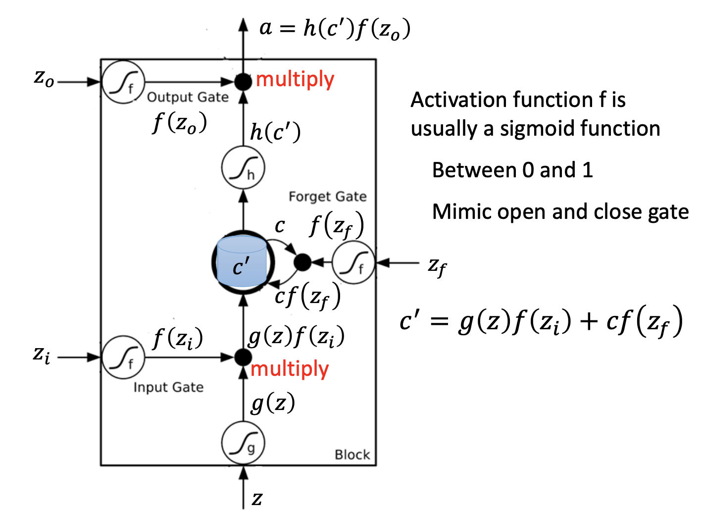

# RNN 网络

## 主要内容

RNN 网络

## 新名词

Slot，LSTM

## 我的关注点

1. RNN本质是做填空问题（slot filling）。比如一句话：I would like to arrive **Hong Kong** in **November**. 如果选择了两个slot：destination和time of arrival，RNN需要能够对输入的每一个词（I，would，like，to，arrive，Hong Kong，on，November）去判断它们分别属于destination或time of arrival的概率，以便进行填空。

2. RNN的输入和输出：输入一个词汇，输出它属于每一个slot的几率。

3. LSTM（Long **Short-Term** Memory）是比较高级的RNN，可以忘掉、不接受、不回忆一些词。行为有点像人脑。

4. 每个LSTM Cell有4个input（**分别控制Input Gate，Output Gate，Forget Gate的3个讯号**以及**网络的其他部分输入Input Gate的消息**）以及一个output（**从该神经元的output gate输入网络的其他部分的Input Gate的消息**）

5. 留意各个Gate是如何让数据进入或忘掉的：

   

   这边的LSTM神经元，每个输入都对应一组权重和偏置，因此和传统RNN相比，LSTM的参数量将会是原来的4倍。

6. GRU是LSTM的简化版本，少了两个Gate但是性能和LSTM差不多

7. Kera支援三种RNN网络（LSTM，GRU，SimpleRNN）

## 派生问题

（此处暂无）
