# BERT

## 主要内容

BERT

## 新名词

BERT；token

## 关注点

1. 基本问题：如何给词语安排一个比较好的向量表示？

   - **方案 1** —— 采用 1-of-N Encoding (one-hot)：

     每一个单词的 embedding 只有 1 个维度非 0：
     $$
     \begin{aligned}
     \text{apple} &= [1, 0, 0, 0, 0, 0] \\
     \text{bag} &= [0, 1, 0, 0, 0, 0] \\
     \text{cat} &= [0, 0, 1, 0, 0, 0] \\
     \text{dog} &= [0, 0, 0, 1, 0, 0] \\
     \text{elephant} &= [0, 0, 0, 0, 1, 0] \\
     \text{bird} &= [0, 0, 0, 0, 0, 1] 
     \end{aligned}
     $$
     缺陷：光看 embedding 没有办法辨识出 2 个单词的关联度，一旦词汇库变大，embedding 的维度也将变大。

   - **方案 2** —— 采用 Word Embedding：

     根据对大量文章的上下文的分析，将调整单词对应的 embedding 使语义/类型相似单词在 embedding 上也相似。

     问题是：单词存在多义性。怎么构造一个比较完备的 Word Embedding，使它能充分地考虑上下文的语境意义？

2. **BERT**：**B**idirectional **E**ncoder **R**epresentations of **T**ransformers

   一般将 BERT 形容成 Transfomer 的 Encoder 部分。

   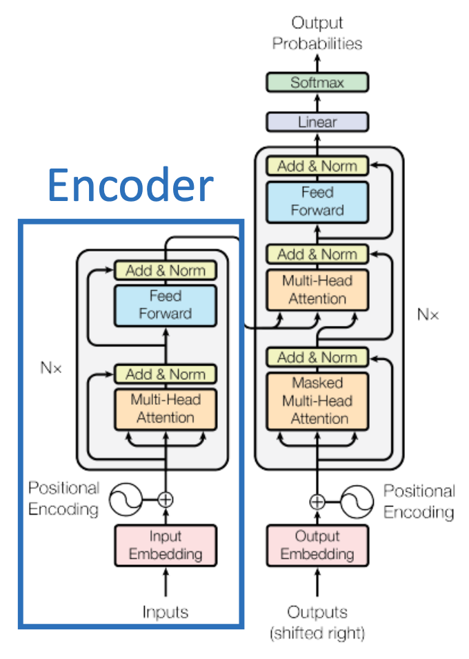

   - **特点**：

     - 只有一个 encoder，因此模型的输入是一系列单词 (一个语句) 的 embedding，输出每个单词 (token) 对应的「输出 embedding」。这种模型在训练时无需对每个单词做注解或做标签 (annotations / tag)，因此是一种运用「**无监督训练** (Unsupervised Trained)」的模型。

     - BERT 的简略模型图如下。

       输入一系列词语的 embedding，输出每个词汇经过 BERT 模型后对应的 embedding。

       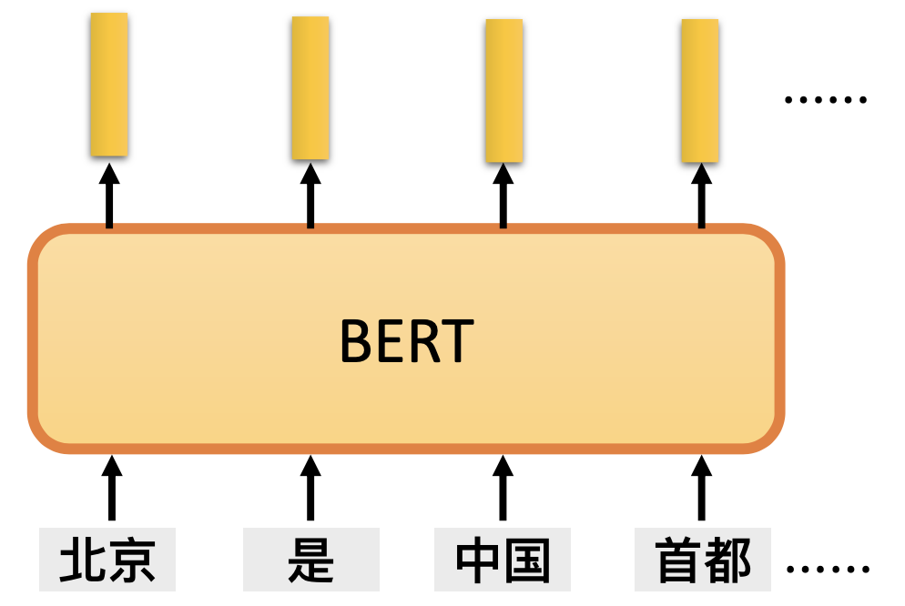

     - 输入 embedding 的构造方案：

       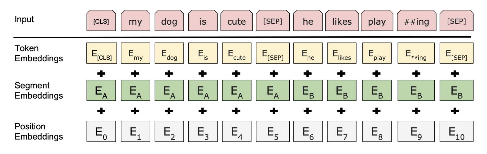

       即，输入 embedding 是由**词汇本身的 embedding**、**对每个语句构造的 embedding (Segment Embeddings)**、**对词汇的位置构造的 embedding (Position Embeddings)** 的加和构成的。

   - **使用方法**：Pre-train + Fine-tune

     - Pre-train：可以用 BERT 来进行语言模型的「预先训练 (Pre-train)」，透过喂入大量语汇资料 (例如从 Wikipedia 上爬来的大量文章)，使用一种或几种**训练方式**使 BERT 从这些语汇资料中学习如何构造 embedding。训练过程是**无监督**的。
     - Fine-tune：拿到通过预先训练的 BERT 模型，在模型后边添加一个根据具体语言任务而设计输出层，用这个输出层将 BERT 模型的输出 embedding 转化为具体问题的答案。Fine-tune 训练时，可以透过问答或填空等方式对 BERT 模型和输出层做合并训练。由于此时 BERT 模型已经进行预训练，各参数的质量已经比较优秀，因此 Fine-tune 过程将只会对 BERT 模型的个别参数作出微调，只有后来才加入的输出层中的参数会产生较大变化。Fine-tune 的过程**可能是有监督**的。

   - **作用**：BERT 模型可以用于许多自然语言处理任务，如：。

     - **MultiNLI** (The Multi-Genre Natural Language Inference) 任务—— 给两条句子，一个是前提 $$P$$ 一个是假设 $$H$$，要输出是否存在语句蕴含关系即是否存在 $$P$$，也就是对语句 $$P$$ 和 $$H$$ 的组合做 3 分类，输出 $$P$$ 和 $$H$$ 矛盾/蕴含/无法推断。
     - **SQuAD** 任务 —— 基于文章攫取的问题回答测试。给两段文字，分别是一篇文章和一个问题，要输出问题的解是文章中的第几个词到第几个词。

3. BERT 模型的 2 种 Pre-train 手段：

   - **Masked Language Modeling** (MLM)：

     单词填空。在训练时添加一层推测单词用的输出层。在训练之前，随机选取一定比率的单词 (论文实验时盖住了 $$15\%$$ 的单词) 并盖住它们。盖住后，再将这些单词输入模型。

     被**选为盖住的单词**在输入时，将有 $$80\%$$ 的可能性被 ```[MASK]``` 替换，有 $$10\%$$ 的可能性被一个随机单词替换，有 $$10 \%$$ 的可能性不做任何修改。模型需要推测出被选为盖住的单词处应该填入的正确单词 (使用线性多分类器)，并且使用 cross-entropy loss 计算预测的损失。

     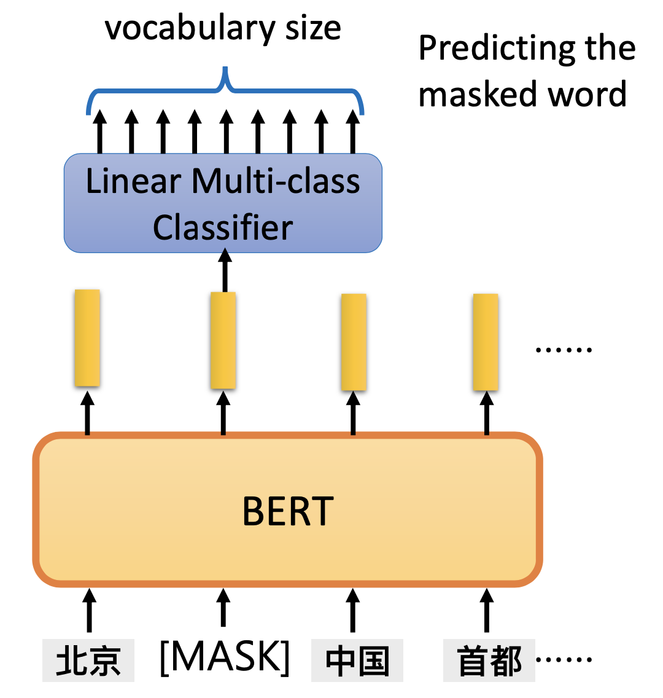

   - **Next Sentence Prediction** (NSP)：

     推测两个句子是否有*连结*关系。对于输入的两个句子 $$A$$ 和 $$B$$，使有 $$50 \%$$ 的几率 $$B$$ 就是 $$A$$ 的后半句，有 $$50 \%$$ 的几率 $$B$$ 是随便从语料库中选择的句子。两个句子 $$A$$ 和 $$B$$ 使用 ```[SEP]``` 分隔。

     在进行 NSP 时，句内有一个名为 ```[CLS]``` 的 token，该 token 所对的输出 embedding 将被用来做二分类使用。在论文中，这个名为 ```[CLS]``` 的 token 被放在句子的开头。

     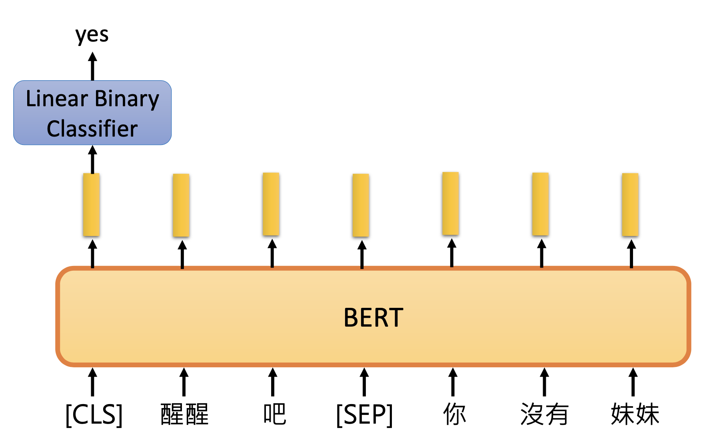

   论文中 Figure 1 描绘的训练过程强调：下面两种 Pre-train 手段是同时被使用的：

   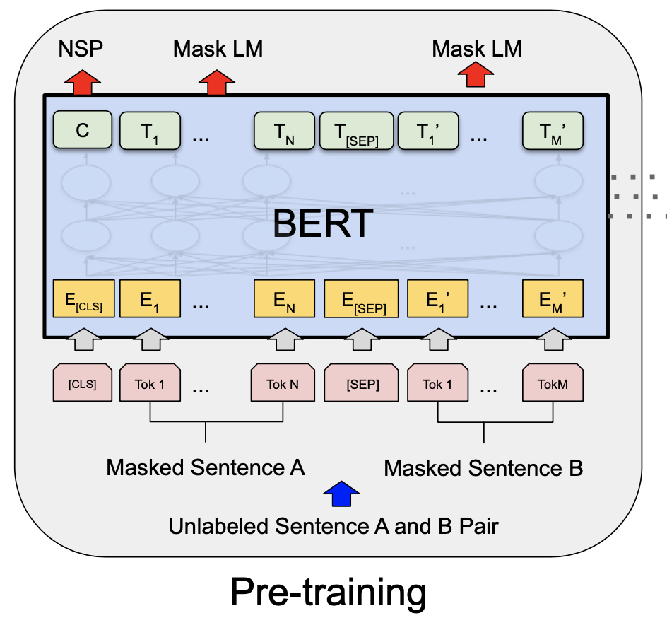

   在Pre-training的过程中，输入的是被盖住的两个句子，会同时输出「对被盖住词汇的推测」以及「两个句子是否有接续关系的判断」两种结果。

4. 用 BERT 来解决的**典型问题**：

   解决典型问题，需要使用预训练的 BERT 模型，再加上对每个问题定制的输出层进行 Fine-tune。

   - **一段文字分类**。例如：情感判断、文章分类

     - 输入：一段文字；输出：给文字的分类；

     - 模型架构如下所示。

       经过预训练好的 BERT 模型后接一层线性分类层。

       给预训练好的 BERT 模型输入一个句子和一个 ```[CLS]``` 位，将 ```[CLS]``` 位所对应的 BERT 输出 embedding 放到分类层去，由分类层给出分类结果，然后计算得出分类的误差，并且更新参数继续训练 (即 Fine-tune 的过程)。

       在 Fine-tune 过程中，线性分类器 (通常是 softmax 分类器) 是从 0 开始训练的 (trained from scratch)，而 BERT 是已经预训练好的，只需「微调参数」。

       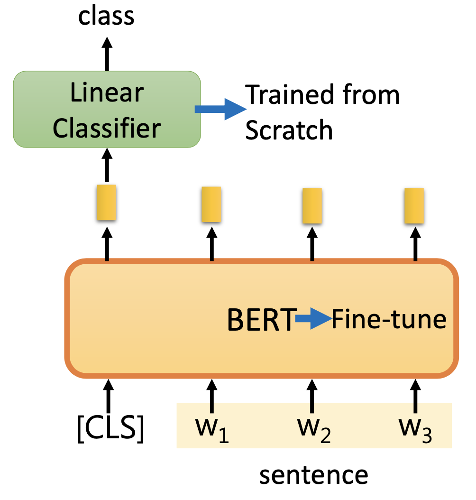

   - **词汇分类**。例如区分句中每个词语的词性，找出语句主题等

     - 输入：一个句子；输出：句中每个词的分类。

     - 架构如下所示：

       向预训练的 BERT 模型中输入一个句子，然后每个句子的输出 embedding 做线性分类，得到每个词语的分类 (如词性、主题等)。

       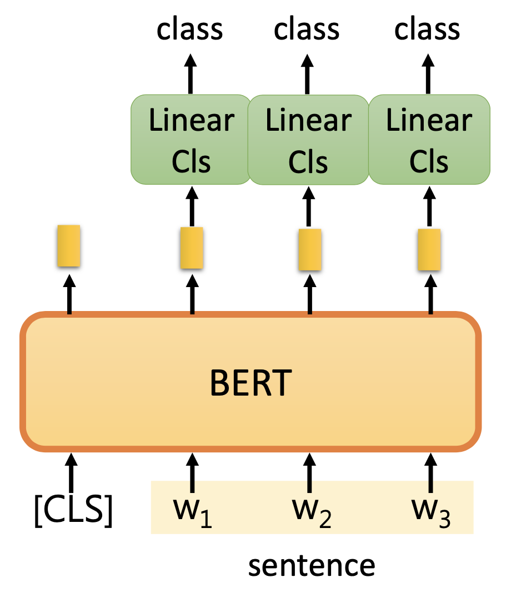

     - 一个词汇分类的实例如下 (Slot Filling)：

       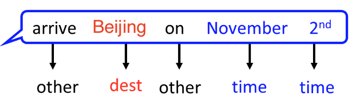

       将「arrive Beijing on November 2nd」输入模型，然后模型将输出 arrive 及 on 的分类为 other，Beijing 的分类为 destination，November 2nd 的分类为 time。

   - **多段文字分类**。例如 MultiNLI 的任务：判断语句之间的蕴含关系。

     - 输入：两个句子；输出：两个句子组合体的分类。

     - 模型架构如下所示：

       向模型中输入两个句子，句子之间用 ```[SEP]``` 分隔，并再加入一个 ```[CLS]```。将模型对 ```[CLS]``` 所对应的输出 embedding 送去做分类，得到多段文字组合体所对应的 class。

       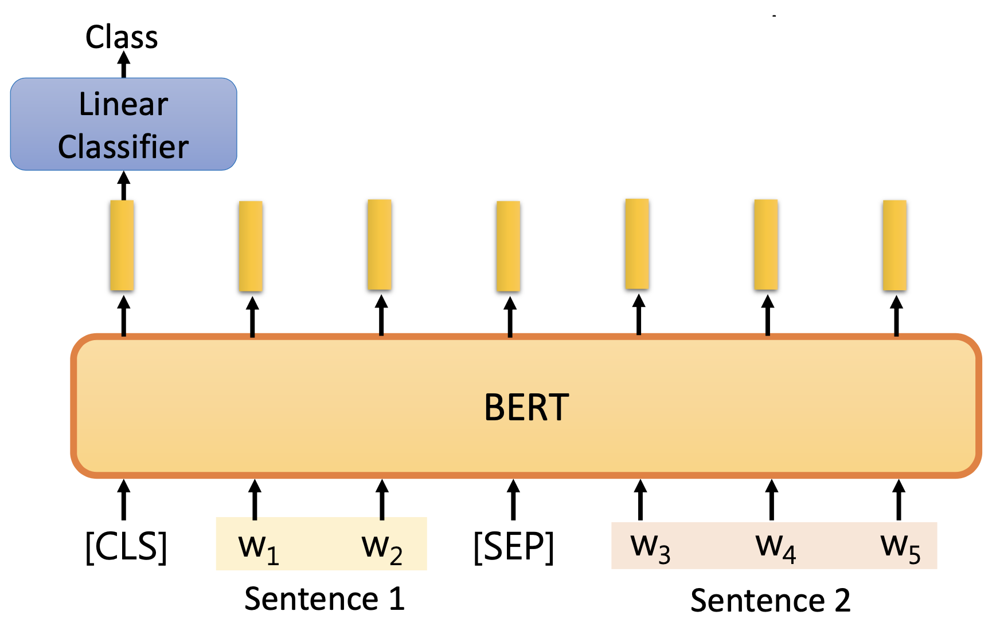

     - 例如在判断语句蕴含关系时，根据是否存在蕴含关系
       $$
       \text{Sentence 1} \rarr \text{Sentence 2}
       $$
       输出分类为 true/false/unknown。

   - **抽取式问答**。例如 SQuAD 任务：给定一篇文章，对于一个特定问题，从文章找出连续的词语作为答案。

     - 输入：一篇文章 $$D = {d_1, d_2, ..., d_n}$$ 及问题 $$Q = {q_1, q_2, ..., q_n}$$ ；

       输出：整数对 $$(s, e)$$

       若 $$s<e$$ 则问题答案是 $$A={q_s, ..., q_e}$$，

       若 $$s=e$$ 则问题答案是 $$A=q_s$$，

       若 $$s>e$$ 则问题答案是 unknown 即此题无解。

     - 模型如下所示：

       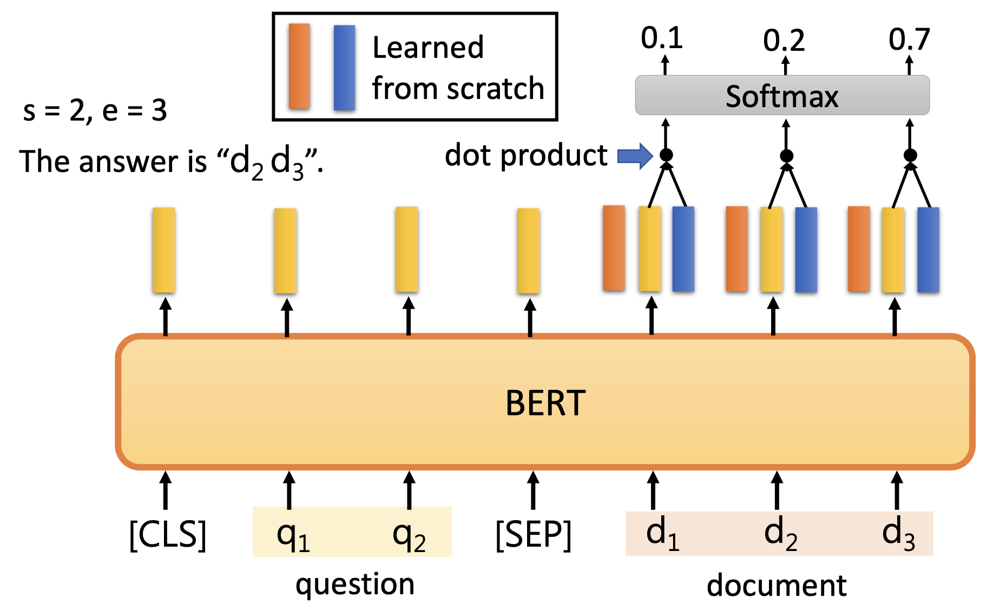

       $$s$$ 和 $$e$$ 各会维护 1 个向量 $$S \in \mathbb R^H$$ 和 $$E \in \mathbb R^H$$，这两个向量维度和 BERT 输出 embedding 的维度相等。

       在图片中向量 $$S$$ 是橙色的， 向量 $$E$$ 是蓝色的。

       将问题和文章用 ```[SEP]``` 隔开并一块输入 BERT 模型中，得到一系列输出 embedding。

       将文章中每个单词的输出 embedding 分别点乘 $$s$$ 向量得到一系列值，把这些值通过 softmax 评分器，得到分数最高的那一个词汇在文章中的编号，记为 $$s$$ 值。

       再将文章中每个单词的输出 embedding 分别点乘 $$e$$ 向量得到一系列值，把这些值通过 softmax 评分器，得到分数最高得的那一个词汇在文章中的编号，记为 $$e$$ 值 (例如上图打分最高的词语是 $$d_3$$，因此 $$e=3$$)。

       最后，由 $$s$$ 和 $$e$$ 的值得出最终答案。

5. BERT 的整个训练生命周期图。

   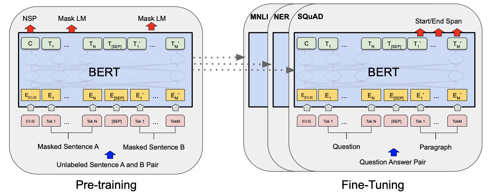

   先预训练模型，再将预训练过的模型拿到特定应用场景去加上特定的输出层做模型微调。

6. BERT **论文实验及跑分**

   - 2 种不同配置的 BERT 模型

     - $$\text{BERT}_\text{BASE}$$：

       12 层

       Hidden Size $$H=768$$ (即 BERT 输入输出 embedding 的维度为 768)

       每一层的多头注意力头数 (Attention Heads) 为 $$A=12$$ 个

       总计参数量达 110 M 个 (1 亿 1 千万多个)

     - $$\text{BERT}_\text{LARGE}$$：

       24 层

       Hidden Size $$H=1024$$ (即 BERT 输入输出 embedding 的维度为 1024)

       每一层的多头注意力头数 (Attention Heads) 为 $$A=16$$ 个

       总计参数量达 340 M 个 (3 亿 4 千万多个)

   - 完成的实验及/或跑分项目

     - **GLUE** (General Language Understanding Evaluation)
     - **SQuAD** (Stanford Question Answering Dataset) v1.0，v2.0
     - **SWAG** (Situations With Adversarial Generations dataset)

