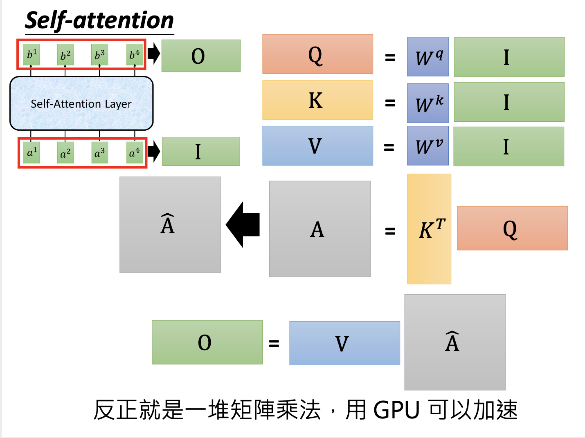

# Transformer 教程材料阅读

## 主要内容

Transformer 整体框架

## 新名词

Self-attention，embedding，attention

## 我的关注点

1. self-attention：不是RNN，但是输入和输出跟RNN是一样的，输入是一个sequence，输出也是一个sequence（seq2seq），是一种神经元。它构成的层叫做Self-Attention Layer。

2. 和RNN不同，self-attention可以平行计算、同时输出所有的输出响亮，而RNN中较后的输出需要依赖较前的输出，不能平行计算。

3. 和双向RNN差不多，self-attention的输出，均是考虑过整个输入sequence的

4. 基本上，RNN Layer能做的东西都能做Self-Attention Layer做的

5. Self-attention中，对于每个输入向量「$x^i$」，对它做一个embedding得到 $a^i$「$a^i=W^ix^i$」。

   再在 $a^i$ 之前，分别乘上三个矩阵 $W^q$，$W^k$及$W^v$ 得到向量 $q^i$，$k^i$及$v^i$， $q^i$ 是 query，$k^i$ 是 key，$v^i$ 是 extraction（要提取的信息）。

   **【加速方法】**这个步骤，可以把所有 $a^i$ 拼合成一个矩阵，在矩阵之前分别乘上三个矩阵 $W^q$，$W^k$及$W^v$ ，就能批量计算所有 $a^i$ 的 $q^i$，$k^i$及$v^i$了：
   $$
   Q=W^qI\\
   K=W^kI\\
   V=W^vI
   $$
   上边的 $$I$$ 是所有输入的向量组成的序列，$Q$，$K$，$V$ 是所有 $q^i$，$k^i$ 及 $v^i$ 分别序列组成的矩阵。

   然后对于每个 $q^i$，拿它去和每个 $k$ 做 **attention** 后，生成 $\alpha$。

   在 self-attention 中做的 **attention** 其实就是「Scaled Dot-Product Attention」，即
   $$
   \alpha_{i,j} = \frac{q^i\cdot k^j}{\sqrt d}
   $$
   其中，${q^i\cdot k^j}$ 其实就是「点乘（Dot-Product）」。点乘的结果是一个**实数**。$d$ 是 $q^i$ 跟 $k^i$ 的维度（dimention）。

   **【加速方法】**这个步骤中的点乘（内积），实际上是 
   $$
   q^i\cdot k^j=k^j\cdot q^i=(k^j)^Tq^i
   $$

   因此，对于所有 $\alpha_{i,j}$ 而言，他们实际上可以批量算出来，例如：
   $$
   \begin{bmatrix} 
   \alpha_{1,1} \\
   \alpha_{1,2} \\
   \alpha_{1,3} \\
   \alpha_{1,4} \\
   \end{bmatrix}
   =
   \begin{bmatrix} 
   (k^1)^T \\
   (k^2)^T \\
   (k^3)^T \\
   (k^4)^T \\
   \end{bmatrix}
   q^1
   $$
   以及：
   $$
   \left[ 
   \begin{array}{c|c} 
   \alpha_{1,1} & \alpha_{2,1} & \alpha_{3,1} & \alpha_{4,1} \\
   \alpha_{1,2} & \alpha_{2,2} & \alpha_{3,2} & \alpha_{4,2} \\
   \alpha_{1,3} & \alpha_{2,3} & \alpha_{3,3} & \alpha_{4,3} \\
   \alpha_{1,4} & \alpha_{2,4} & \alpha_{3,4} & \alpha_{4,4} \\
   \end{array} 
   \right]
   =
   \begin{bmatrix} 
   (k^1)^T \\
   (k^2)^T \\
   (k^3)^T \\
   (k^4)^T \\
   \end{bmatrix}
   q^1q^2q^3q^4
   $$
   其实就是
   $$
   A=K^TQ
   $$
   得到所有 $q^i$，$k^i$ 之后拼成矩阵，一乘，就能马上得出所有 $\alpha_{i,j}$。这样就能批量计算啦！

   至于为什么算 attention 要除以 $\sqrt d$，直观的解释是 ${q^i\cdot k^j}$ 会随着他们的维度越大，在相乘的时候，数值会越大，便除以一个 $\sqrt d$ 来缓一缓。论文中有解释 为啥除的是 $\sqrt d$。

   做完 attention 之后，会得到一个分数（$\alpha_{i,j}$，是数）。然后将 $\alpha_{i,j}$ 通过一层 softmax 得到 $\hat\alpha_{i,j}$：
   $$
   \hat\alpha_{i,j}=\frac{e^{\alpha_{i,j}}}{\sum_j{e^{\alpha_{i,j}}}}
   $$
   之后，利用如下公式：
   $$
   b^i=\sum_j{\hat\alpha_{i,j}v^j}
   $$
   将 extraction 向量「$v^j$」拿进来运算，拼合成一个新向量「$b^i$」

   这边每个 $b^i$ 构成的序列便是 self-attention 输出的sequence。

   **【加速方法】**实际上，所有 $b^i$ 亦能用矩阵运算一下算出：
   $$
   [b^1;b^2;b^3;b^4]=[v^1;v^2;v^3;v^4]\left[ 
   \begin{array}{c|c} 
   \hat\alpha_{1,1} & \hat\alpha_{2,1} & \hat\alpha_{3,1} & \hat\alpha_{4,1} \\
   \hat\alpha_{1,2} & \hat\alpha_{2,2} & \hat\alpha_{3,2} & \hat\alpha_{4,2} \\
   \hat\alpha_{1,3} & \hat\alpha_{2,3} & \hat\alpha_{3,3} & \hat\alpha_{4,3} \\
   \hat\alpha_{1,4} & \hat\alpha_{2,4} & \hat\alpha_{3,4} & \hat\alpha_{4,4} \\
   \end{array} 
   \right]
   $$
   或者写作：
   $$
   O=V\hat A
   $$

6. 加速方法总结图：

   

7. Self-attention：可以让神经网络看到任意远的信息。只要神经网络能让对应的 $\hat\alpha_{i,j}$ 非 0，就能注意到对应输入向量的信息。

8. 请留意以下图片，体会矩阵的变化过程：

   

9. multi-head self-attention：每一个输入向量可以分别有多个q，k，v，每一个q，k，v关注一个特定问题。输出可以有多个 b 向量，也可以由多个 b 向量经过堆叠和线性变换后输出1个特定维数的 b 进行输出：

   

10. 文章中提到encoder中还有一个**「feed forward」层，这一层是一个两层的全连接层**，第一层的激活函数为 ReLu，第二层不使用激活函数。

11. decoder中的第一个 multi-head self-attention 层有「mask」。在 Decoder 的时候，是需要根据之前的翻译，求解当前最有可能的翻译，而 **Mask 操作可以防止在分析第 i 个单词的时候知道 i+1 个单词之后的信息**。

    

## 派生问题

（此处暂无）