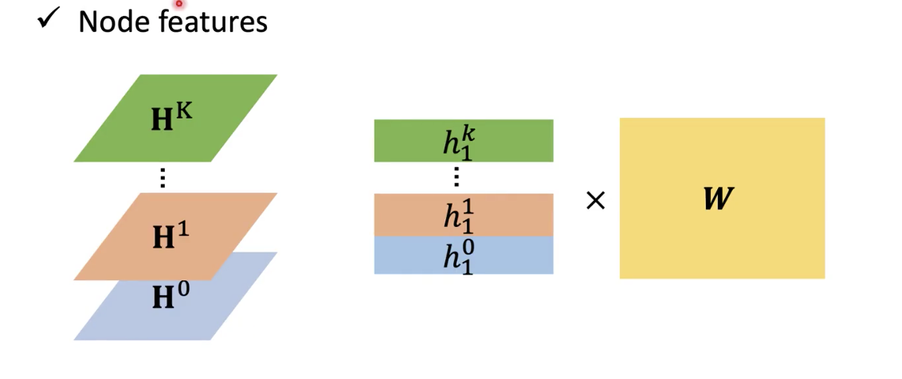

# GNN

## 前置知识

GNN (基本的卷积方法)；回归模型 (regression model)

## 主要内容

GNN (入门)；Graph 上的 Convolution (空间方法)

## 新名词

spatial-based convolution (空间方法)；CORA；MUTAG；Aggregate (聚合)；Readout

## 我的关注点

1. 图的定义：
   $$
   G=(V,E,W)
   $$

   - 这边 $$V$$ 是**结点集**，并令 $$n=|V|$$ ； $E$ 是**边集**； $$W$$ 是图的**权重邻接矩阵**，有 $$W \in \mathbb{R}^{n \times n}  $$

   - 每个结点都有一组 ($$d$$ 个) **特征**（即，结点 $$i$$ 的**特征向量** $$f_i$$ 是一个 **$$d$$ 维的向量**）

   - 所有结点的**特征向量**汇聚成一个**特征矩阵**： $$X \in \mathbb{R} ^ {n \times d}$$ ，**特征矩阵**的每一个**列**可称之为图的所有结点上的一个「**信号**」(signal)

   - 例如某个**特征矩阵**如下：
     $$
     X=\begin{bmatrix} 
     0 & 1 & 2 & 3 & 5 \\
     3 & 7 & 1 & 4 & 0 \\
     4 & 1 & 8 & 5 & 7 \\
     9 & 0 & 6 & 9 & 7 \\
     \end{bmatrix}
     =
     \begin{bmatrix} 
     f_1^T \\
     f_2^T \\
     f_3^T \\
     f_4^T \\
     \end{bmatrix}
     =
     \begin{bmatrix} 
     s_1, s_2, s_3, s_4, s_5
     \end{bmatrix}
     $$
     上边 $$f_1$$ 至 $$f_4$$ 是这四个神经元的**特征向量**（5 维），而 $$s_1$$ 至 $$s_5$$ 是图节点的 5 种**信号**，其中： $$f_i \in \mathbb{R} ^ d $$ ，而 $$s_i \in \mathbb{R} ^ n$$ 。

2. **Graph Neural Network**：

   - **宏观性状**：输入是一个「图」，而不是一个 sequence / matrix。

   - **用途**：

     - **Classification (分类)**：例如，输入一个分子结构，输出它是否可能导致蛋白质突变；
     - **Generation (生成)**：例如，输入一些条件，输出一些满足条件的「化学分子结构」。

   - **graph 上的「convolution」** 是一般 GNN 都运用的一种普通方案。

     所谓 graph 上的「convolution」，是【利用一些「仅有的资讯」(有限的 Labeled Node 及图已有的 structure) 来训练出一个比较好的 model】的方案：

     - 对于每个 node，都去调查它的**邻居**以帮助 model 做训练 (近朱者赤、近墨者黑)；

     - 通常用**「convolution」**将结点 embed 进一个「feature space」，来将结点和它的邻居联系起来；

     - convolution 的种类：

       (1)   **spatial-based convolution (空间方法)** —— 将 CNN 的 convolution 推广到 graph，典型代表：**GAT**；

       (2)   **spectral-based convolution (谱方法)** —— 将 graph 上的 convolution 化归到讯号处理中的「convolution」(比较玄幻)，典型代表：**GCN**。

3. 一个 GNN Model 可以完成的一些**任务**：

   - (Semi-)Supervised **Node Classification**：例如输入分子结构输出是否可能导致突变；
   - Regression
   - Graph Classification
   - Graph Representation Learning
   - Link Prediction

   衡量一个 GNN 模型的好坏一般是完成这些任务后再进行公平比较

4. GNN 上一般使用的 **Dataset**：

   - CORA：一整个有关论文的 citation network (**即总共是 1 个 graph**)，有 2.7k 个 node 及 5.4k 个 link。
   - MUTAG：包含有 188 个化学分子 (**即总共有 188 个 graph**)，每个分子 (视为一个 graph) 平均有 18 个 node。

5. **Spatial-based Graph Convolution** (图卷积的空间方法)：

   - 一种将 CNN 中的「convolution」拓展到图上的卷积方案。

   - **「卷积」的过程**及其与 CNN 的比较：

     - 在 CNN 中的 「卷积」：

       对于描述**本层** hidden layer 的 feature map 上的某个元素 $$e_j$$，用 feature map 对它以及它的所有邻居 (要求是可以构成和 feature map 一样大的范围的邻居) 做内积后，得到**下一层 feature map** 上对应位置的 hidden layer 信息。

     - 在 GNN 中的「卷积」：

       对于某个结点「$$v_j$$」，利用**它**以及**它的所有邻居**「**在第 $$i$$ 层的 feature** (又称「**hidden state**」，即$$h^{(i)}$$)」，来得到**这个结点**的下一层 feature  ($$h_j^{(i+1)}$$)。每一层 convolution 对所有结点都做这个操作。

       这个操作叫做「**Aggregation (聚合)**」。

       

       例如在上图，现在拥有第 $$0$$ 个隐藏层的图的所有信息。对于第 3 个结点 $$v_3$$，利用**它**以及**它的所有邻居**「即 $$v_3, v_0, v_4, v_2$$」在本层 (第 0 层) 的 hidden state (即  $$h_3^{(0)}, h_0^{(0)}, h_4^{(0)}, h_2^{(0)}$$)，来得到 $$v_3$$ 的下一层 (第 1 层) 之 hidden state (即 $$h_3^{(1)}$$)。这称为对 $$v_3$$ 做一次 Aggregation。

       对 $$v_0, v_1, v_2, v_4$$ 也做同样的 Aggregation 操作，便得到了第 $$1$$ 个隐藏层的图的信息。

       【**注意**】Aggregation 的操作，在不同 GNN 模型中实现的方式是不同的。

   - **Readout (读出)**：

     在 classification 等任务中，可能除了要关注**每个结点**本身的 hidden state，还要关注图作为一个整体的状态。「图作为一个整体的状态」被称为「**Graph Representaion**」

     在得到所有结点在最后一层的 feature (即，得到了整个图在最后一层的 hidden state) 之后，将它们集合起来，得到一个能代表整个 graph 的 representation，称为「**Readout**」。

6. **NN4G (Neural Network for Graph)**：

   - 模型做的事情：

     - 模型可以 (以不限于层叠的方式) 联结  $$n$$ 个 hidden layer。其中，第 0 个 hidden layer 做 embedding，而其他 hidden layer 做「aggregation」。

     - 第 0 个 hidden layer：将每个顶点 $$v_i$$ 都**点乘**一个**与该层相关的**权重向量 $$\overline w^{(0)}$$，以得到该顶点的第 0 个 hidden state ($$h_i^{(0)}$$)。即：
       $$
       \begin{aligned}
       h_i^{(0)} &= \overline w^{(0)} \cdot x_i \qquad{\rm ;or}\\
       h_i^{(0)} &= \sum_{s=0}^L\overline w_s^{(0)} x_{i,s}
       \end{aligned}
       \tag{6.1}
       $$
       其中

       $$h_i^{(0)}$$ 是第 $$i$$ 个顶点的第 0 层 hidden state，是**一个数字**；

       $$\overline w^{(0)}$$ 是第 0 层的权重**向量**，而 $$w_s^{(0)}$$ 是该权重向量的第 $$s$$ 个元素；

       $$x_i$$ 是**输入**第 $$i$$ 个顶点的特征**向量**，而 $$x_{i,s}$$ 是该特征向量的第 $$s$$ 个元素；

       $$L$$ 是 $$\overline w^{(0)}, x_i$$ 两向量的**维度**。

     - 得到众 $$h_i^{(0)}$$ 之后，便对第 1 层及之后的每一层都做另一种 (aggregation) 操作。例如第 $$l$$ 层 hidden layer：

       要对每个 node 都做 aggregation。**对于第 $$i$$ 个 node**：
       $$
       h_i^{(l)}=f \left (
       \sum_{s=0}^L \overline w_s^{(l)} x_{i,s} + 
       \sum_{s=0}^{l-1} \sum_{u_j \in \mathcal N(v_i)}\hat w_{(i, j)}^{(l,s)}h_{j}^{(s)}
       \right ) \tag{6.2.1}
       $$
       或
       $$
       h_i^{(l)}=f \left (
       \overline {\boldsymbol w}^{(l)} \cdot {\boldsymbol x}_{i} + 
       \sum_{s=0}^{l-1} \sum_{u_j \in \mathcal N(v_i)}\hat w_{(i,j)}^{(l,s)}h_{j}^{(s)}
       \right ) \tag{6.2.2}
       $$
       或 [^1]
       $$
       h_i^{(l)}=f \left (
       \overline {\boldsymbol w}^{(l)} \cdot {\boldsymbol x}_{i} + 
       \sum_{s=0}^{l-1} 
       \left [
       \hat {w}^{(l,s)} \sum_{u_j \in \mathcal N(v_i)} h_{j}^{(s)}
       \right ]
       \right ) \tag{6.2.3}
       $$
       即：

       此处，设 $$v_i$$ 结点的邻居为 $$\mathcal N(v_i)$$。**对于每个邻居** $$u_j$$：

       从第 0 层到第 $$(l-1)$$ 层，对于每一层 $$s$$，它所对应的【「第 $$l$$ 层至第 $$s$$ 层的**层连结权重矩阵 ($$\hat w^{(l,s)}$$**)」当中，有关结点 $$i$$ 到结点 $$j$$ 的那个权重 $$\hat w_{(l,s)}^{(i,j)}$$ 与 结点 $$j$$ 在这一层 (第 $$s$$ 层) 的 hidden state 相乘的结果】累加起来，再加上

       第 $$l$$ 层的权重**向量** $$\overline {\boldsymbol w}^{(l)}$$ **点乘**结点 $$i$$ 的输入特征**向量** $${\boldsymbol x}_i$$ 得到的数字。

       这样得到的就是当 $$l \ge 1$$ 时，结点 $$i$$ 的**隐藏层值** ($$h_i^{(l)}$$)。

     - 按照例子，对第 0 个和第 1 个 hidden layer 进行 aggregate 的过程如下图：

       

       即，第 0 层将输入的图进行一次线性变换 (embedding)，得到 $$h_i^{(0)}$$，然后第 1 层将**每个顶点**进行 aggregate 操作 —— 先将该点 $$i$$ 的邻接点的第 0 层的 hidden state 加起来，然后用「第 $$1$$ 层至第 $$0$$ 层的**层连结权重矩阵 ($$\hat w^{(1,0)}$$**)」对它们进行一次线性变换，之后再加上 $${\overline {\boldsymbol w}}^{(1)} \cdot {\boldsymbol x}_{i}$$。

   - Readout 的方式：

     - 经过很多层处理后，**网络**的 **Readout 表示值** $$y$$ 即为每层「所有点的 hidden state 平均值 $$X_l$$」经过一个变换「$$w_l$$」之后，得到的值之和：
       $$
       \begin{aligned}
       y &= \sum_{l=0}^{L} w_lX_l 
       \\&= \sum_{l=0}^{L} \left( \frac{w_l}{N} \sum_{i=0}^N h_i^{(l)} \right)
       \\&= \sum_{l=0}^{L} w_l\cdot{\rm MEAN}(h^{(l)})
       \end{aligned}
       \tag{6.3}
       $$

7. **DCNN (Diffusion-Convolution Neural Network)**

   - 模型做的事情：

     - 对于每一层、每一个结点都做如下 **aggregation**：
       $$
       {\boldsymbol h}_i^{(l)} = {\boldsymbol w}_i^{(l)} {\boldsymbol m}_i^{l-1} \tag{7.1}
       $$
       其中，$$i \ge 0$$，

       $${\boldsymbol w}_i^{(l)}$$ 是第 $$i$$ 层的**权重向量**；

       $${\boldsymbol m}_i^l = {\rm MEAN}({\rm distance\_between}(i, \cdot)=l)$$ ，即「与结点 $$v_i$$ 之距离**可以等于** $$l$$ 的结点」的**特征向量之均值**；

       因此，每个结点的 hidden state 都是一个向量

     - 对整个网络做完所有 aggregation 之后，可以算出每一个**结点**的「node feature」，以便进行「node classification」：
       $$
       y_i=H_i \times W \tag{7.2}
       $$
       其中，

       $$H_i = \left[ {\boldsymbol h}_i^{(0)} {\boldsymbol h}_i^{(1)}, ..., {\boldsymbol h}_i^{(L)} \right]^T = \begin{bmatrix} {\boldsymbol h}_i^{(0)} \\ {\boldsymbol h}_i^{(1)} \\ ... \\ {\boldsymbol h}_i^{(L)}\end{bmatrix}$$，是点 $$v_i$$ 的「隐藏态堆叠矩阵」，

       $$W$$ 是一个变换矩阵

       

8. **DGN (Diffusion Graph-Convolution Neural Network)** [^2]：

   - Aggregate 的过程和 DCNN 一样
   - 对于求「node feature」，则是将 $$H_i$$ 直接相加后得到矩阵 $$H$$ ，再经过对其每一行进行抽取和变换后得到。

9. **MoNet (Mixture Model Networks)**：

   - 特征：和 NN4G 比较相似，但是它在 aggregate 的时候，不仅仅是简单的 hidden state 相加，而还考虑了一些「重要性」因素：
     $$
     {\boldsymbol h}_i^{(l + 1)} = \sum_{u_s \in \mathcal N(v_i)} w({\boldsymbol u}_{(i, s)}) \times {\boldsymbol h}_s^{(l)} \qquad(l \ge 0) \tag{9.1}
     $$
     其中：

     $$w(\cdot)$$ 是一种线性变换，而 $${\boldsymbol u}_{(x, y)}$$ 是介于结点 $$x, y$$ 之间的边的「权重表示向量」，在论文中使用的表示法是：
     $$
     {\boldsymbol u}_{(x, y)}=\left[ \frac{1}{\sqrt{{\rm deg}(x)}}, \frac{1}{\sqrt{{\rm deg}(y)}}\right]^T
     $$

10. **GAT (Graph Attention Networks)**：

   - 重点：

     不想直接用 weighted sum，因为传统 weighted sum 的**算法是人为指定的**，可能产生不好的效果。能不能够找一种「计算机能够自行学习出每一条边的权重」，而不必用 MoNET 这种利用既定的公式直接计算的方案？

     于是引入了 Attention 的机制。

   - Attention 机制：在本模型中，Attention 机制应用在任意的 2 个结点之间。每个结点都**对它的每一个邻居「做 attention」**，以求出一种叫做「energy」的值。

     **「energy」值**，即是「**某个邻居对该结点有多重要**」的度量。

     透过每个点的 energy 的值来做 weighted sum，比起直接用特定公式计算出 weighted sum 更实惠以及准确。

     两个点「**做 attention**」，就是用一个 **attention 函数**，输入这两个点在本层的 hidden state，输出这两个点在本层的 energy 值。例如，用「attention」计算两个结点 $$i,j$$ 的 energy 值是这样处理的：
     $$
     e_{i, j}^{(l)}=f(h^{(l)}_i, h^{(l)}_j) \tag{10.1}
     $$
     其中，$$f$$ 就是机器需要根据样本学习出来的函数。

   - aggregate 的方案：

     对于结点 $$i$$，在第 $$l$$ 层：
     $$
     {\boldsymbol h}_i^{(l+1)}= \sum_{u_j \in \mathcal N(v_i)} e_{i, j}^{(l)}W{\boldsymbol h}_i^{(l)}
     $$
     其中，$$e_{i, j}^{(l)}$$ 是第 $$l$$ 层点 $$j$$ 对点 $$i$$ 的 energy 值，而 $${\boldsymbol h}_i^{(l)}$$ 是点 $$i$$ 在第 $$l$$ 层的 hidden state 向量，$$W$$ 是一个权重矩阵 (应该是参数共享的)

## 派生问题

(此处暂无)

[^1]: $$6.2.3$$ 纯属俺个人合情整出来的公式 =_=
[^2]: 不够详细