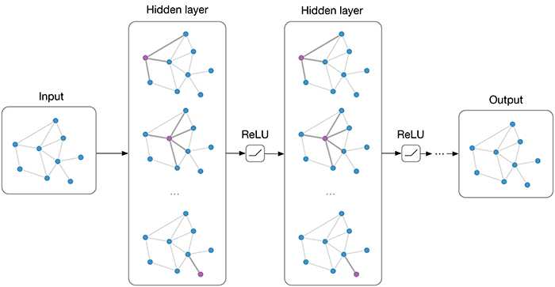

# GCN 网络 (2)

## 主要内容

GCN 网络 (基本)

## 新名词

（此处暂无）

## 我的关注点

1. GCN 的基本框架：图由两个矩阵构成
   $$
   G(A,H)
   $$

   - 其中， $$A \in \mathbb{R}^{N \times N}$$ 是图的**邻接矩阵**， $$H \in \mathbb{R}^{N \times F}$$ 是图的**特征矩阵**， $$N$$ 是节点的数量，而 $$F$$ 是每个节点的**特征**数量
- 特征：就是每个节点的标签。比如**图的每个节点**都是「人」，那么节点的特征就包括「姓名」「出生年月」等。
   - 输入：一个图；输出：图中节点都属于什么类别

2. GCN 的目标是要学习出一个函数：
   $$
   f(X,A)
   $$

   - 该函数能够输入两个矩阵： $$X$$ 是起始的特征矩阵（一般是随机初始化的）， $$A$$ 是图的邻接矩阵。GCN还分有好多个层，一般一层一层计算直到每层的输出趋于收敛为止，参考 3
   - 该函数能够输出一个矩阵： $$Z \in \mathbb{R}^{N \times F}$$ ，是一个特征矩阵，其中 $$N$$ 表示图中点的个数， $$F$$ 表示每个点的**输出特征数量**。
   - 输出矩阵 $$Z$$ 还可以拿去做池化

3. 根据目标，每个 GCN 层的计算公式是：
   $$
   H^{(l+1)} = f(H^{(l)}, A)
   $$
   **论文采用的公式**是：
   $$
   H^{(l+1)} = \sigma({\tilde D}^{-\frac{1}{2}}{\tilde A}{\tilde D}^{-\frac{1}{2}}H^{(l)}W^{(l)})
   $$
   其中：

   -  $$H^{(l)}$$ 是位于第 $$l$$ 层的GCN层通过激活函数「$$\sigma(\cdot)$$」后的输出，而 $$H^{(0)}$$ 是神经网络的输入特征矩阵 ($$H^{(0)} \in \mathbb{R}^{N \times D})$$ 

   - 图中的节点个数为 $$N$$ ，每个节点拥有 $$D$$ 个特征

   -  $${\tilde A} = A + I_N$$ 是图的邻接矩阵， $$I_N$$ 是 $$N$$ 阶单位矩阵，因此 $${\tilde A}$$ 其实是「**添加了自环的邻接矩阵**」

   -  $${\tilde D}$$ 是图的度矩阵，是一个对角矩阵，对角线上每一个元素值表示图中每一个节点的度。 $${\tilde D}$$ 可以透过 $${\tilde A}$$ 计算出：
     $$
     {\tilde D_{ii}}=\sum _j {{\tilde A}_{ij}}
     $$
     $${\tilde D}$$ 是可以训练的，在整个GCN框架中共享

   -  $$W^{(l)}$$ 是图的权重矩阵，和层数相关，可以训练

4. GCN 的步骤：

   - 

   

## 派生问题

（此处暂无）