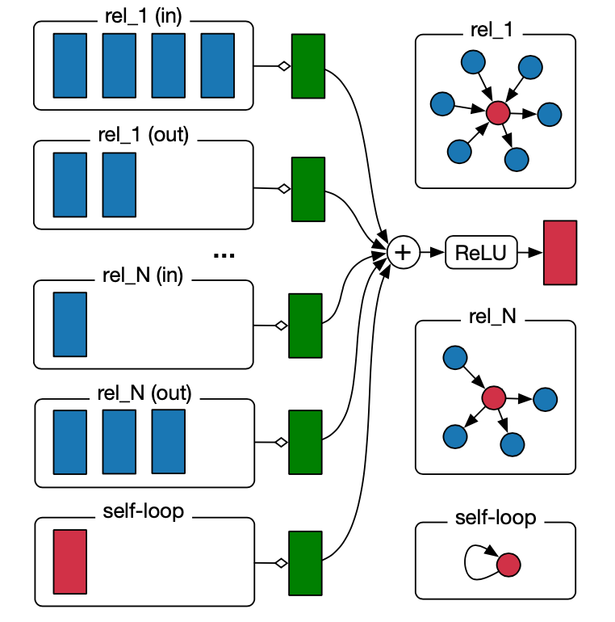
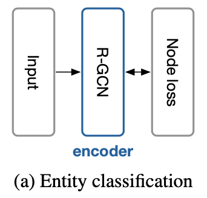

# R-GCN 论文阅读摘要

## 新名词

softmax classifiers; cross-entropy loss; tensor factorization model; DistMult; sparsity constraints; hidden state; normalization constant; feature vectors; overfitting; direct sum; negative sampling; hyperparameter tuning; 

## 我的关注点

1. 「知识库」模型的概况：

   - 知识库由一系列**三元组 (triple)** 构成：
     $$
     {\rm (subject, predicate, object)}
     $$

     - 三元组中这三个东西从左到右分别是关系的主体、谓语及客体。

     - 例如，一个关系「$${\rm (Han\ Li, born\_in, Nanning)}$$」表达了图的两个**实体 (entity)**：「$$\rm Han\ Li$$」及「$$\rm Nanning$$」，而将「$$\rm born\_in$$」是为一个**关系 (relation)**。

   - SRL (Statistical Relational Learning) 主要的任务：推测「消失」的资讯，比如

     - 推测实体的「分类」(Entity Classification)，在上述模型中就是将「种类」资讯附加到缺失该资讯的「实体」上；或
     - 关系的「推测」(Link Prediction)，在在上述模型中就是将缺失的三元组「恢复」出来。

   - 上述 SRL 的两个推测或分类任务，在实际操作时，「缺失的资讯」一般可以从缺失的资讯的**周围结构**推测出来。能够利用「周围结构」是 R-GCN 区别于 GCN 的特点之一。为了利用「周围结构」，R-GCN 模型为图中的**实体 (entity)** 构造了一个「encoder」

2. R-GCN 所利用的图模型：
   $$
   G=\mathcal{(V,E,R)}
   $$
   其中：

   - $$v_i \in \mathcal V$$ 是图中的结点 (entities / nodes) 集；
   - $$(v_i, r, v_j) \in \mathcal E$$ 是边 (relations / edges) 集；
   - 每个边中的 $$r$$ 是一种「关系种类」，$$r \in \mathcal R$$ 是关系 (relation type) 集

3. 一个 R-GCN 网络单元的模型公式 (**propagation model** for **calculating the forward-pass update** of an entity / node) 「aggregation」
   $$
   h_i^{(l+1)}=\sigma
   \left[
   \left(
   \sum_{r \in \mathcal R}
   \sum_{j \in \mathcal N_i^r}
   \frac{1}{c_{i,r}}
   W_r^{(l)}
   h_j^{(l)}
   \right)
   +
   W_0^{(l)}
   h_i^{(l)}
   \right]
   
   \tag{2}
   $$

   - 其中，
     - $$h_i^{(l)}$$ 是结点 $$v_i$$ 在模型第 $$l$$ 层之隐藏单元的 hidden state；

     - $$\mathcal R$$ 是图 $$G$$ 的所有**关系种类**；$$\mathcal N_i^r$$ 是结点 $$v_i$$ 在关系 $$r$$ 下的**所有邻居**的 index 集合；

     - $$c_{i,r}$$ 是一个「normalization 常量」，受【网络所处理问题种类】所影响，可以是一个**将被学习的参数**，也可以**提前人为指定** (比如指定 $$c_{i,r} = |\mathcal N_i^r|)$$；

       论文中说，提前人为指定这个常量可能会使「高度结点」在训练时吃亏；

     - $$W_r^{(l)}$$ 是本层的一个关于关系种类 $$r$$ 的**权重矩阵**；$$W_0^{(l)}$$ 是另一个**权重矩阵**，在本层范围是唯一的，不与 $$r$$ 有关；

   - (2) 式实际上是对结点「$$v_i$$」做 **aggregation** 的过程。

   - 在 (2) 式中，**前半部分**是
     $$
     \sum_{r \in \mathcal R} \sum_{j \in \mathcal N_i^r} {\frac1{c_{i,r}}}W_r^{(l)}h_j^{(l)}
     $$
     - 可以认为该部分是：把结点「$$v_i$$」的所有**相邻结点**经过「线性变换」后的特征向量进行「**正常化累加**」

     - 和 GCN 不同，上面所说的这种**线性变换**还受 $$v_i$$ 与相邻结点之间的**关系性质**所决定 (relation-specific transformations)，即决定于所研究的关系 (relation) 的种类 (relation type) 和方向 (direction)

       即：同一组关系的不同方向，视为两个不同的关系，要分开来加和

   - 在 (2) 式中，**后半部分**是
     $$
     W_0^{(l)}h_i^{(l)}
     $$
     加上这个算式的原因是：确保该结点在第 $$l+1$$ 层的 $${\rm hidden\ state}$$ 亦能受**该结点自己**在第 $$l$$ 层的状态所影响，因此为所有结点添加了这样一种「self-connection」。

   - (2) 式对于不同结点 (不同的 $$i$$ 值) 的计算方式一样，因此在当前层 $$l$$ 进行计算时，对图中的不同结点可以做**平行计算**。

   - (2) 式还可以用矩阵法进行高效运算？：
     $$
     h_i^{(l+1)}=\sigma \left [
     \left (
     \sum_{r \in \mathcal R}
     \frac{1}{c_{i,r}}
     W_r^{(l)}
     \sum_{j\in \mathcal N_i^{r}}
     h_j^{(l)}
     \right )
     +W_0^{(l)}h_i^{(l)}
     \right ]
     $$

   - 结点 $$v_i$$ 的某个 hidden state 计算流程见下图：

     

     可以很清晰地发现，对于每种 relation (如 rel_1)，结点 $$v_i$$ 的入结点和出结点是分开加和的 [如 rel_1 (in)，rel_1 (out)]，并最终加入了一个 self-loop 后，经激活函数 (图中是 $$\rm ReLU(\cdot)$$) 产生该 unit 输出

4. **正则化**：在实际操作中，关系 (relation) 的数目可能很多，而对于每个关系都需要一个权重矩阵 $$W_r$$，参数数量很庞大，存储开销大；也可能造成 overfitting。

   因此每一层的矩阵 $$W_r^{(l)}$$ 需要正则化。

   提出了两种正则化方法，以减小需要学习的参数总数。

   - **Basis** decomposition (基分解)
     $$
     W_r^{(l)} = \sum_{b = 1}^B a_{rb}^{(l)}V_b^{(l)}
     $$

     其中，

     - $$V_b^{(l)}$$ 是一个编号为 $$b$$ 的「基」，$$b \in [1, B]$$，$$B$$ 是事先定义好的「基的数量」；

     - 为了达到相同变换效果，$$V_b^{(l)}$$ 跟原来的 $$W_r^{(l)}$$ 的维度是一样的，即 $$V_b^{(l)} \in \mathbb R^{d^{(l+1)} \times d^{(l)}}$$ ，其中 $$d^{(l)}$$ 是第 $$l$$ 层 hidden state ($$h_i^{(l)}$$) 向量的**维度**；

     - $$a_{rb}^{(l)}$$ 是一个和 $$b$$ 相关的参数向量，可以是 1 维的 (数)，也可能是多维的。

     发现：

     - 本来，在一层网络中，对每种关系都要学习整个 $$W_r ^{(l)}$$ 矩阵；

       我们这样进行正则化之后 —— 留下来的参数中和 $$r$$ 有关的只有**向量**「$$a_{rb} ^{(l)}$$」—— 便使每种关系在**本层**只需学习 $$B$$ 个**参数向量** $$a_{r1}^{(l)}, a_{r2}^{(l)}, ..., a_{rB}^{(l)}$$ 即可；

     - 其他参数，在本层考虑的**所有关系**之间都是共享的 ($$V_1^{(l)}, V_2^{(l)}, ..., V_B^{(l)}$$)，可以在拥有较多关系的图中，减小参数个数；

     - 同时，一些稀有的关系种类**并不需要**如此多参数来进行刻画，如今取缔了大量参数，而稀有的和常见的那些关系种类都 share 同一批参数 ($$V_1^{(l)}, V_2^{(l)}, ..., V_B^{(l)}$$)，因此预计可以缓解**在稀有的关系种类上**模型可能出现的 overfitting 现象。

   - **Block-diagonal** decomposition (分块对角矩阵分解)
     $$
     W_r^{(l)} = \bigoplus_{b = 1}^B Q_{rb}^{(l)} = {\rm diag}(Q_{r1}^{(l)},Q_{r2}^{(l)},...,Q_{rB}^{(l)})
     $$

     其中，因为 $$Q_{r1}^{(l)},Q_{r2}^{(l)},...,Q_{rB}^{(l)}$$ 所组成的分块对角矩阵的形状要和 $$W_r ^{(l)}$$ 相同，而且它们都一样大，所以 $$Q_{rb}^{(l)} \in \mathbb R^{(d^{(l+1)} / B) \times (d^{(l)} / B)}$$

     - 本来，对每种关系都要学习整个 $$W_r ^{(l)}$$ 矩阵；我们这样进行正则化之后，便使每种关系只需学习一系列比较小的矩阵「$$Q_{r1}^{(l)},Q_{r2}^{(l)},...,Q_{rB}^{(l)}$$」即可；
     - 也就是把原本的 $$W_r^{(l)}$$ 硬生生搞成了分块对角矩阵，这样亦可以在拥有较多关系的图中减小参数个数

5. 论文中提到：目前 R-GCN 没有像 GCN 那样利用结点的特征向量，而每个结点仅用一个 one-hot vector 表示。

6. **实体分类** (entity classification) 任务

   - 使用一个叠加了 $$L$$ 个 R-GCN 层构成的网络，在最后一层的输出后接续一个 Softmax 分类器

   - 损失函数：

     将对所有「已经做过 label 的结点」计算交叉熵损失函数，以得到**网络输出** (即最后一层 R-GCN 层的输出向量)「$${\boldsymbol h}_i^{(L)}$$」和**基本事实**「$${\boldsymbol t}_i$$」的区别：
     $$
     \mathcal L = -\sum_{i\in \mathcal Y}\sum_{k=1}^Kt_{ik}\ln h_{ik}^{(L)}
     $$
     其中

     - $$\mathcal Y$$ 是所有「(分类过的) 的结点」的索引的集合；
     - $$h_{ik}^{(L)}$$ 是结点 $$v_i$$ 经过该网络的**输出向量**的第 $$k$$ 个项 (the $$k$$-th entry of the network output)
     - $$t_{ik}$$ 是 $$h_{ik}^{(L)}$$ 所对应的基本事实标签 (respective ground truth label)

     上式可写作：
     $$
     \mathcal L=-\sum_{i \in \mathcal Y}{\boldsymbol t}_i \cdot \boldsymbol \ln {\boldsymbol h}_i^{(L)}
     $$
     其中

     - 「$$\boldsymbol t_i$$」是结点 $$i$$ 的基本事实标签向量，即**期望网络输出的值**，是「**真实值**」
     - 「$$\boldsymbol \ln {\boldsymbol h}_i^{(L)}$$」是向量 $${\boldsymbol h}_i^{(L)}$$ 的每一个项经过 $$\ln(\cdot)$$ 处理后得到的向量。$${\boldsymbol h}_i^{(L)}$$ 是网络的「**预测值**」

   - 实验模型训练的设定：

     - 使用了 full-batch 梯度下降；
   - 叠了 $$L = 2$$ 个 R-GCN 层，而每一层中有 16 个「hidden unit」(AM 数据库使用 10 个 hidden unit)；
     - 采用「基分解 (basis-decomposition)」；
     - 采用 Adam 的梯度下降方法进行训练，50 个 epoch，学习率为 0.01；
     - normalization 常量 $$c_{i,r} = |\mathcal N_i^r|$$
     
   - 实体分类的模式图：

     

     这边的意思是 input 的图 $$G=\mathcal{(V,E,R)}$$ 被输入一个层叠的 R-GCN 层，R-GCN 层最后输出分类，计算每个已知答案结点的 Node Loss，然后进行梯度下降更新参数

7. **连结预测 (link prediction)** 任务

   - 使用一个叠加了 $$L$$ 个 R-GCN 层的网络作为编码器，一个 **DistMult** 作为译码器，由译码器输出**可能的预测值及其评分**

   - 任务及大致方案：

     - 对于图 $$G=\mathcal{(V,E,R)}$$，其中边集合「$$\mathcal{E}$$」目前不完整，只知道它的一个子集「$$\mathcal{\hat E}$$」。任务是将「$$\mathcal{\hat E}$$」进行补充。

     - 大致方案：对于每一个**可能存在于** $$\mathcal{E}$$ 的三元组 $$(s,r,o)$$，

       用一个**打分函数** $$f(\cdot)$$ 去判断 $$f((s,r,o))$$ 的值 —— 该值表示该三元组 $$(s,r,o) \in \mathcal{E}$$ 的可能性；

       也就是说，用**打分函数** $$f(\cdot)$$ 可以用来判断将要添加进图中的边 $$(s,r,o)$$ 是否符合要求。

     - 在该项目中，用 encoder 将所有 entity 编码，然后由 decoder (即打分函数) 进行打分和输出。

   - **具体解决方法**（实体编码 + 打分函数）：

     - 用 $$L$$ 层 R-GCN 网络作为编码器 (不含 Softmax)，将**每个实体 (即结点)** $$v_i \in \mathcal V$$ 都编码成一个 $$d$$ 维**实数向量** $$e_i \in \mathbb {R}^d$$。很明显在该项 project 中，这个编码器输出的就是第 $$L$$ 层 R-GCN 的**输出值**：
       $$
       e_i = h_i^{(L)}
       $$

     - 用 **DistMult Factorization** 作为译码器，利用前面编码的这些 $$e_i$$ (vertex representations) 的信息，用一种函数「$$f:\mathbb R^d \times \mathcal R \times \mathbb R^d \rarr \mathbb R$$」来对**每一种可能的** $$\rm{(subject, relation, object)}$$ 三元组进行评分。
       
       在该 project 中实际使用的函数是：
       $$
       f(s,r,o)=e_s^TR_re_o
       $$
       其中，每个关系 $$r$$ 都被表示为一个对角矩阵 $$R_r \in \mathbb R^{d \times d}$$。
       
       此即上边所谓「打分函数」。

     - 采用「负采样法 (Negative Sample)」

   - 损失函数是「**根据负采样**优化后的交叉熵损失」：
     $$
     \mathcal L=
     -\frac{1}{(1+\omega)|\mathcal{\hat E}|}
     \sum_{(s,r,o)\in \mathcal T_p}
     \log \sigma(f(s,r,o))+
     \sum_{(s,r,o)\in \mathcal T_n}
     \log(1-\sigma(f(s,r,o)))
     $$
   或
     $$
     \mathcal L=
     -\frac{1}{(1+\omega)|\mathcal{\hat E}|}
   \sum_{(s,r,o,y)\in \mathcal T}
     y\log \sigma(f(s,r,o))+
     (1-y)\log(1-\sigma(f(s,r,o)))
     $$
     其中
     
     - $$\mathcal T_p, \mathcal T_n$$ 分别是「负采样」时「正的」和「负的」三元组的集合，且 $$\mathcal T_p \cup \mathcal T_n =\mathcal T$$
     - $$\sigma(\cdot)$$ 是 logistic sigmoid function
     - $$y \in \{0, -1\}$$ 的值在 $$(s,r,o)$$ 为正三元组 (positive triple) 时取 1，而在 $$(s,r,o)$$ 为负三元组 (negative triple) 时取 0。
     
   - 采样时，随机破坏每个正例子的 subject 或 object，实现随机采样。

   - 实验模型训练的设定：

     - 采用 MRR (Mean Reciprocal Rank) 和 Hits at $$n$$ (H@n) 方法作为评估的量度，两种方法都同时采用「raw」和「filtered (更 reliable)」方式评定。

       评定了 MRR，以及 Hits at $$1,3, 10$$

     - normalization 常量设定为 $$c_{i,r} = c_i = \sum_r |\mathcal N_i^r|$$，即**对所有关系种类共享**一个常量；

     - 对 FB15k 及 WN18 数据库采用 $$B=2$$ 的 Basis Decomposition，及对 $$h_i^{(l)}$$ 这些 embedding 都采用 $$d=200$$ 的向量；

     - 对 FB15k-237 数据库采用 $$Q \in \mathbb R^{5 \times 5}$$ 的 Block Decomposition，及对 $$h_i^{(l)}$$ 这些 embedding 都采用 $$d=500$$ 的向量；

     - 在进行 normalization 之前，做了一次 dropout：以 dropout rate = 0.2 的概率删除 self-loop，及 drouout rate = 0.4 的概率删除图的其他 edge；

     - 对 decoder 使用 L2-正则化，使 penalty 参数 $$\lambda = 0.01$$；

     - 使用 Adam，基本学习率 $$\eta = 0.01$$；

     - 负采样率 $$\omega = 1$$；

     - 梯度下降时采用 full-batch。

   - 

